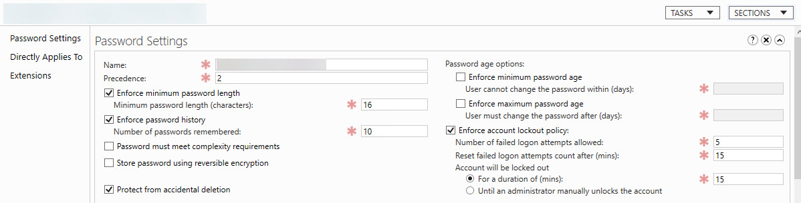

The standard is to enforce policies based on reputable regulatory organizations (e.g. NIST, ACSC) latest recommendations.

<!--endintro-->

::: good  

:::

When passwords have to be changed they should meet the following complexity requirements:

1. **Ignore password complexity (numbers, special characters, spaces) but require longer passwords** - E.g. Require 16 characters length minimum, without special characters or numbers
2. **Longer passphrases are better than passwords** - They are even [more difficult to crack than complex passwords](https://www.zdnet.com/article/fbi-recommends-passphrases-over-password-complexity) 
2. **Longer password history remembered** - E.g. Cannot use the last 10 passwords you already used
3. **Blocking of common password and words** – E.g. [Via Azure AD Password Protection](https://learn.microsoft.com/en-us/azure/active-directory/authentication/concept-password-ban-bad-on-premises)
4. **[Use of MFA (Multi Factor Authentication) everywhere possible](/do-you-have-mfa-multi-factor-authentication-enabled)**
5. **Use a password manager**
6. **Use different passwords for every service**
7. **Enforce a lockout policy** - E.g. If a user gets their password wrong 5 times, their account will be locked out for 15 minutes

::: info
**Important:** Requiring users to change their passwords (e.g. every 180 days) **does not** improve security. If you already have a strong password (as above) and a second factor of authentication (e.g. MFA), changing it does very little to make you more secure. Generally, you should change your password only when you believe it has been compromised.
:::
