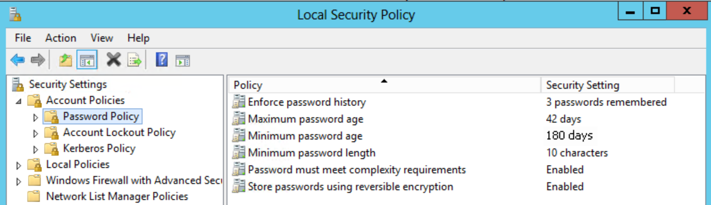

We recommend enforcing strict password policies.

Below is a capture of the settings we use:

<!--endintro-->

When passwords have to be changed they must meet the following minimum requirements:

* Not contain all or part of the user's account name
* Be at least six characters in length
* Contain characters from three of the following four categories:

  * English uppercase characters (A through Z)
  * English lowercase characters (a through z)
  * Base 10 digits (0 through 9)
  * Non-alphanumeric characters (e.g., !, $, #, %)

Passphrases are better than passwords, they are even more difficult to crack than complex passwords https://www.zdnet.com/article/fbi-recommends-passphrases-over-password-complexity/

Complexity requirements are enforced when passwords are changed or created. We also enforce a lockout policy so if a user gets their password wrong 5 times, their account will be locked out for 15 minutes.

Bad practice: Requiring users to change their passwords e.g. every 180 days does not improve security. In the current world, if you already have a strong password (as above) and a second factor of authentication (MFA: See https://www.ssw.com.au/rules/do-you-have-mfa-multi-factor-authentication-enabled) changing it does very little to make you more secure.

Generally, you should change your password only when you believe it has been compromised.