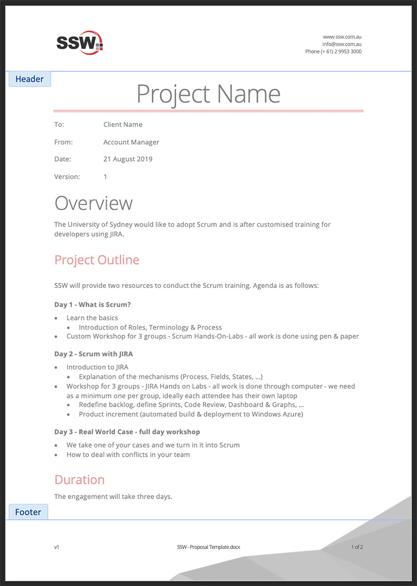
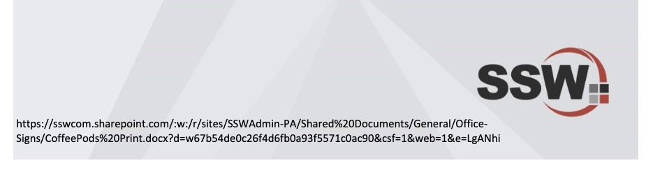

A strong header and footer will make the client sure that document is from your company in any page he is looking at.

<!--endintro-->

* Make sure the document Header contains your company LOGO and contact information.
* Make sure the document Footer contains the filename (Hyperlinked with the URL) and the version number as per https://www.ssw.com.au/rules/show-version-numbers/

::: good

:::

::: bad

:::