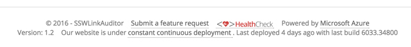
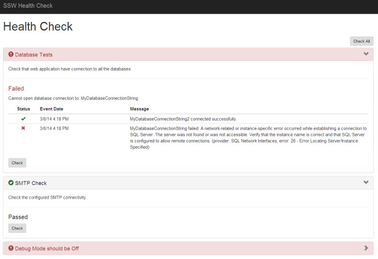
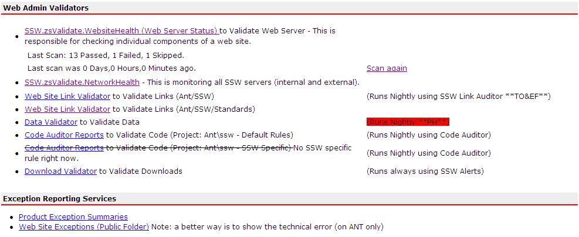

How can you know that all components are working correctly on your site? It is vitally important to have a 'Health Check' page to validate everything is working correctly. This page will check the server and make sure:

* all the DLLs are present (and registered for COM ones)
* all the web services are working
* all the databases are alive, etc.

<!--endintro-->

  

You would be surprised how many dependencies a large web page can have.The advantage of this page is if you ever need to redeploy your application on another server or you have some pages that are just not working as planned you can load up this page and get a quick diagnostics of your website.

  

  

See [SSW Rules - Do you have a zsValidate page to test your website dependencies?](https://www.ssw.com.au/ssw/Standards/Rules/RulesToBetterUnitTests.aspx#zsValidatePage)
