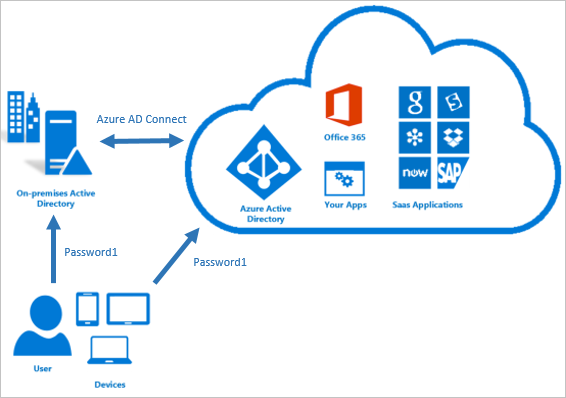

Azure Active Directory (AAD) Password Hash Synchronization (PHS) is one of the methods you can use if you want to have your identities synced to the cloud, alongside Pass-through Authentication (PTA) and Federation with AD FS.
If you have a hybrid identity in place with AAD, chances are you are already synchronizing password hashes to the cloud with Azure AD Connect Sync.

<!--endintro-->

AAD PHS synchronizes the password in on-premises AD with AAD so you can use your on-premises password to log in to cloud services, like Azure or Office 365. It also allows you to implement Seamless Sign-On for domain-joined machines, so users don't need to log in twice when opening their emails in a browser, for example.

AAD PHS also allows you to have an absolute lean infrastructure on-premises, as the only needed moving part is Azure AD Connect Sync to be installed in a server or Domain Controller. No agents or internet-facing machines necessary.

The web requests don't even come to your server, they are server by Microsoft's big pool of servers around the globe!

::: good  
  
:::

You can check out a deep dive of AAD PHS in official Microsoft documentation at [What is password hash synchronization with Azure AD?](https://docs.microsoft.com/en-us/azure/active-directory/hybrid/whatis-phs)
