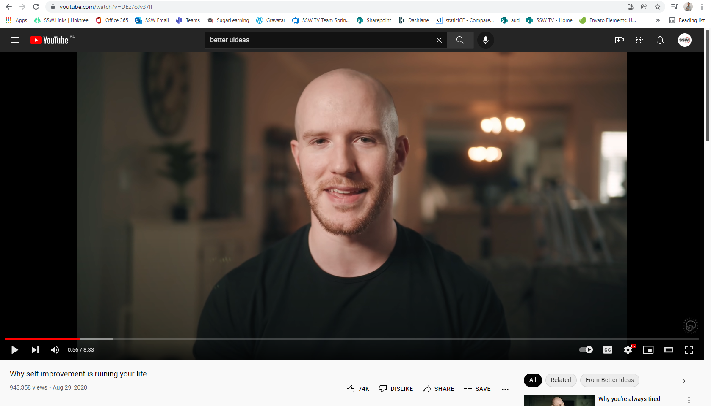

Light can improve your productivity and the general quality of your calls. The best light will always be the natural one from a window.

Here are some tips:

* If you have a desk lamp, move it so it is not directly on your face or on a white background to avoid extreme contrasting on your image
* Avoid having light (even from a window) behind you, otherwise, it can create annoying glare on your monitor or shadows on your work station
* You can have a nice work station with some decorative lights, such as desk lamps
* On general principle, you always want the subject to be the brightest and most well-lit subject in the frame. This may not be possible with your lighting situation, but worth noting if it can be helped. 

A good tip from     [The Spruce blog](https://www.thespruce.com/tips-for-better-home-office-lighting-1812436) is to position your home office station facing north or south so that the sunlight doesn't throw a shadow at any point during the day, making you move your setup frequently.

