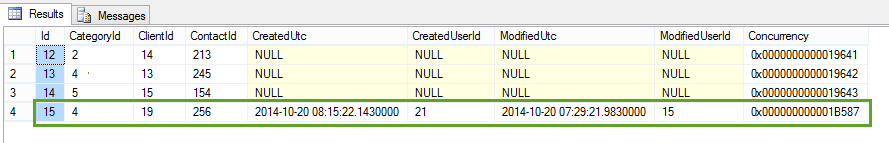

Follow the below standards for tables and columns.

1. All tables should have the following fields:

| **Field**  |  **SQL Server Field Properties**  |
| --- | --- |
| CreatedUtc | datetime2 Allow Nulls=False Default=GETUTCDATE() |
| CreatedUserId | Foreign Key to Users table, Allow Nulls=False |
| ModifiedUtc | datetime2 Allow Nulls=False Default=GETUTCDATE() |
| ModifiedUserId | Foreign Key to Users table, Allow Nulls=False |
| Concurrency | rowversion Allow Nulls=False|

<!--endintro-->

  

**Note #1:** Never set the CreatedUtc field - instead use a default GETUTCDATE()

**Note #2:** These fields offer basic row auditing that will cover the majority of applications. When an application has specific auditing requirements, they should be analysed to see if this approach is sufficient.

2. All databases should have a table with one record to store application Defaults. This table should be called 'Control'.

If the settings are not application-wide, but just for that user then an XML (do not use an INI file) for simple stuff might be better. Examples are saving the 'User' for logon, 'Select Date Range' for a report, form positions, etc.

.NET programs have an Application.Configuration which exports to XML file (app.config) automatically. It works very well, and deployment is very simple. It's integrated right into the Visual Studio.NET designer as well.

3. All databases should have a version table to record structural changes to tables. See [SSW Rules to Better Code](/rules-to-better-code)
 
4. Lookup tables that have just two columns should be consistent and follow this convention: CategoryId (int) and CategoryName (varchar(100)).

The benefit is that a generic lookup form can be used. You will just need the generic lookup form pass in the TableName and Column1 and Column2.

**Note #3:** The problem with the naming is the primary keys don't match.

**Note #4:** The benefit with the character primary key columns is that queries and query strings have meaning Eg. ssw.com.au/ssw/Download/Download.aspx?GroupCategoryID=5BUS from this URL I can guess that it is in the business category.
