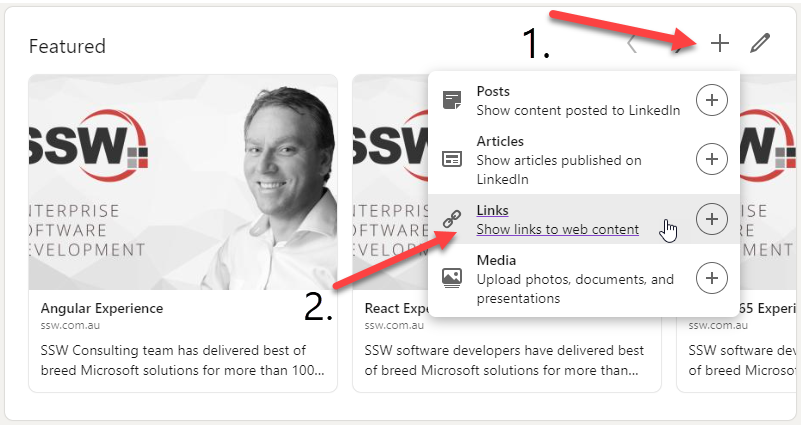
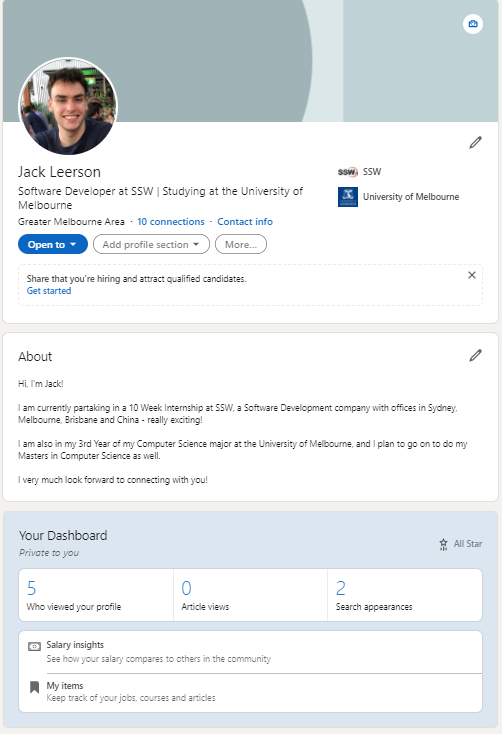
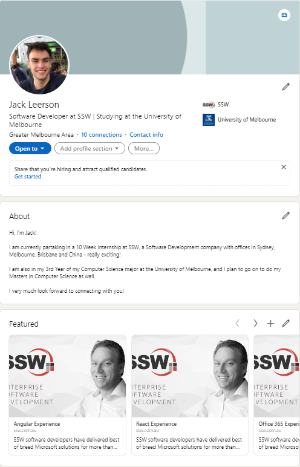

​​​LinkedIn is the main business and employment-oriented social networking service available. It's important to keep it up-to-date and link it to your company's services. 

 <excerpt class='endintro'></excerpt> 
<dl class="image">​​ <dd>Figure: In the Featured ​​section, use the "+" and then "Links" buttons to include the URLs for the main services your provide. </dd><dd> </dd>​​​</dl><dl class="badImage"><dd>Figure: Bad example - Profile with no links</dd></dl><dl class="goodImage"><dt>  </dt><dd>Figure: Good example - Profile with links to main services provided    </dd></dl>

