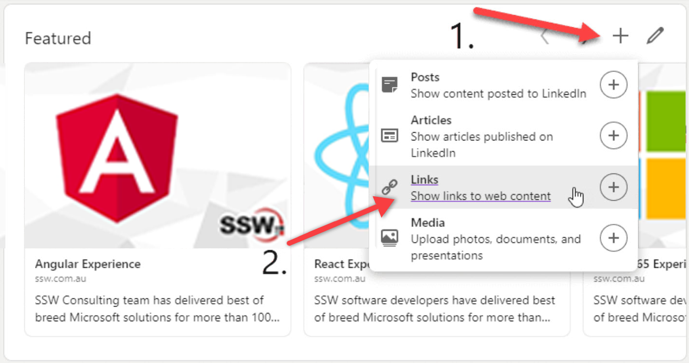
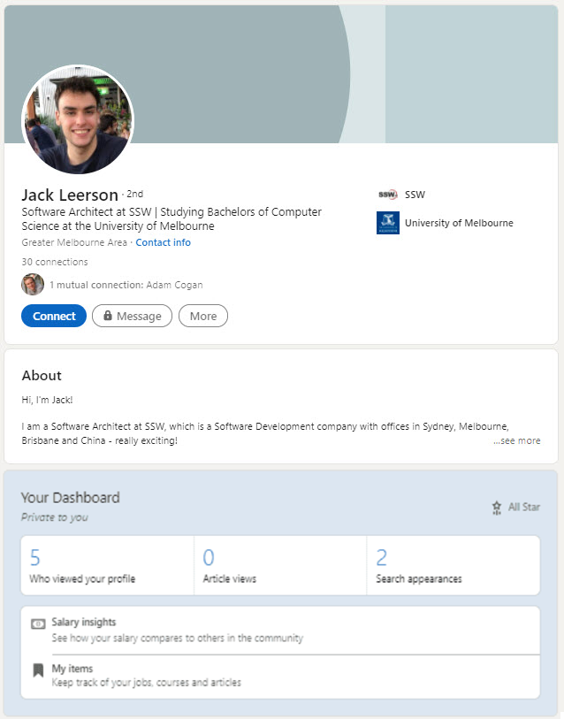
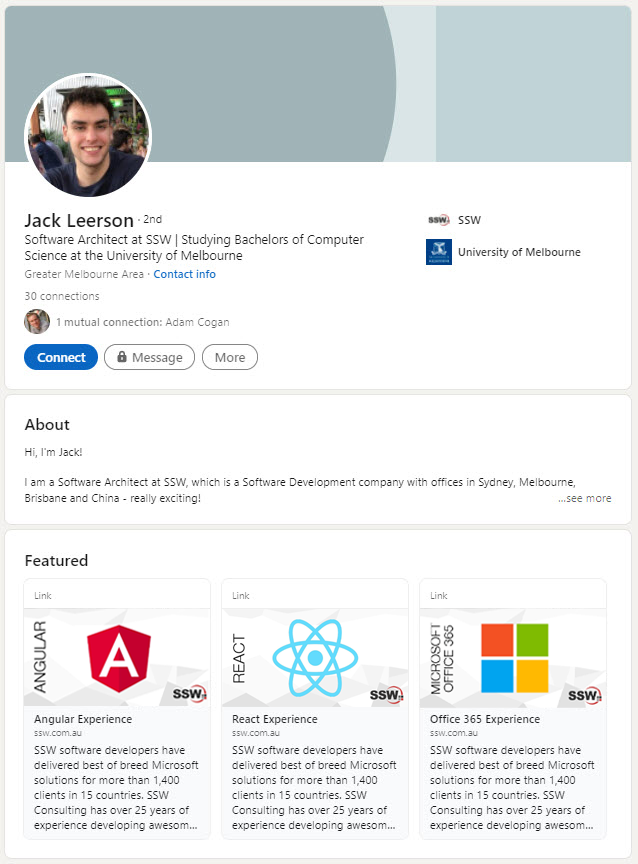

LinkedIn is the main business and employment-oriented social networking service available. It's important to keep it up-to-date and link it to your company's services.

<!--endintro-->

::: bad

:::

::: good

:::