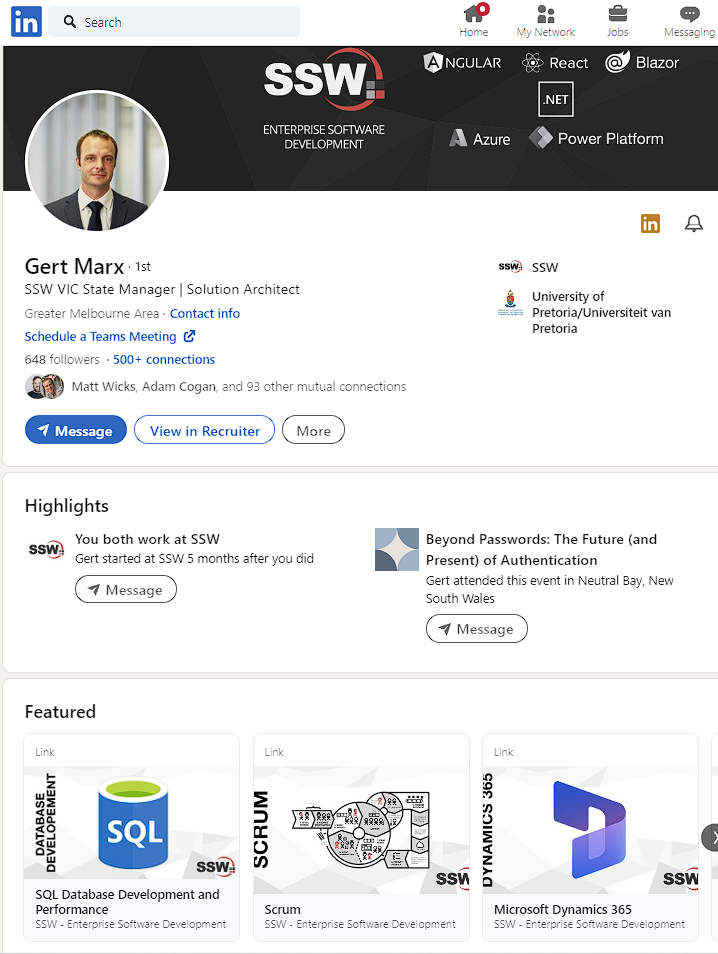

LinkedIn is the main business and employment-oriented social networking service available. It's important to keep it up-to-date and link it to your company's services.

<!--endintro-->

A featured section will allow you to highlight services in your profile. To achieve that, follow the instructions from LinkedIn: [Add Sections to Your Profile | LinkedIn Help](https://www.linkedin.com/help/linkedin/answer/a540837/add-sections-to-your-profile)

::: bad

:::

::: good

:::
