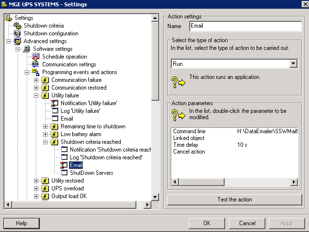

Of course, all your servers are on UPS. (If not they should be!) How do you know that all the money you paid for a UPS was worth it thought? How many times has it saved our servers? How long do the battery's last for before they go flat? Why was a server off when you came in in the morning?

<!--endintro-->

If you get your UPS to email you when an event occurs then you will have answers to these questions.
The problem is that there is no uniform software that will work with all UPS's as they all have their own format.
All UPS's come with management software that can perform these actions. You just need to install it.

We use an MGE UPS so we use Personal Solution Pac which allows you to run script files on events. We just call a script file which will send us an email.

