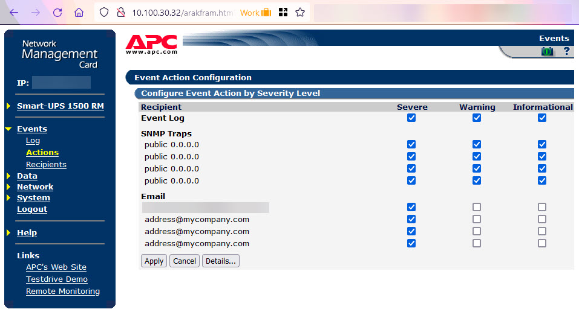

Of course, all your servers are on UPS. (If not they should be!) How do you know that all the money you paid for a UPS was worth it? How many times has it saved our servers? How long do the batteries last for before they go flat? Why was a server off when you came in in the morning?

<!--endintro-->

If you get your UPS to email you when an event occurs then you will have answers to these questions.
The problem is that there is no uniform software that will work with all UPS's as they all have their own format.
All UPS's come with management software or hardware that can perform these actions. You just need to set it up.

For example, SSW use APC UPS' and they have physical management cards (hardware), which are able to send emails. The event categories are "severe", "warning" and "informational".

