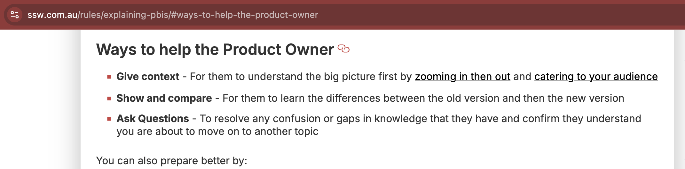

Help readers get exactly where they need to go by making your headings linkable. 

This enables quick jumps to sections, easy sharing of precise URLs, and stable links even if the wording changes by assigning a custom ID. 

<!--endintro-->

::: info
See the [Google Developer Style Guide on headings and anchor targets](https://developers.google.com/style/headings-targets) for clear examples and best practices.
:::

## ✅ Benefits

* Faster navigation within long pages
* Easy sharing of specific sections
* Stable links via custom IDs
* Consistent style using lowercase with hyphens

::: info


## Example: From heading to anchor link

Say you have a documentation page with many sections.

**Markdown heading:**

```md
## Getting started
```

This heading will auto-generate an anchor `#getting-started`.

**HTML heading with an explicit ID:**

```html
<h2 id="getting-started">Getting started</h2>
```

**Link to access that section of the page:**

```html
https://example.com/docs#getting-started
```

::: good

:::

## MDX / React implementation (auto-IDs + autolinks)

If you render Markdown/MDX in a React app, add slug and autolink plugins so headings get IDs and clickable anchors automatically. Example (Next.js + MDX):

```js
// next.config.mjs
import createMDX from '@next/mdx';
import rehypeSlug from 'rehype-slug';
import rehypeAutolinkHeadings from 'rehype-autolink-headings';

const withMDX = createMDX({
  extension: /\.mdx?$/,
  options: {
    rehypePlugins: [
      rehypeSlug,
      [rehypeAutolinkHeadings, { behavior: 'wrap' }],
    ],
  },
});

export default withMDX({
  pageExtensions: ['ts', 'tsx', 'js', 'jsx', 'md', 'mdx'],
});
```
