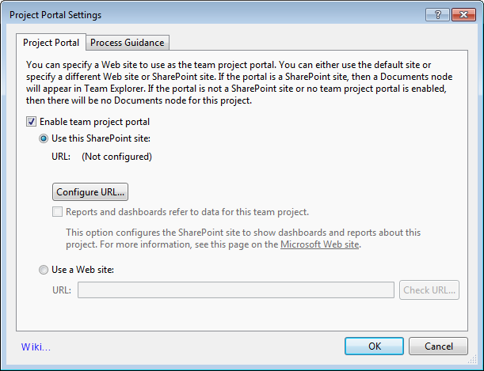

In agile development; updates, changes and bug fixes happen all the time and an issue that a user encounters today might already is fixed or have a workaround. That is why each page or form should link to a wiki page with any common problems that a user might encounter (and workarounds for them) and planned changes.

<!--endintro-->

This saves the end user from resorting to crawling the web for solutions.
<dl class="bad">&lt;dt&gt;
 <strong>From:</strong> Tech Support  <strong>Sent:</strong> Wednesday, 27 January 2010 4:31 PM  <strong>To:</strong> Mr Northwind  <strong>Subject:</strong> RE: Issue with lab management hosts

Hi Mr Northwind

There was a bug in Beta2 (fixed in upcoming RC release) wherein even if you have no lab artifacts in a host group, it did not allow you to delete host group from a Project collection in Team Foundation Admin Console UI until you delete the host groups explicitly from all the associated team projects. 

<ol><li>
Run the following commands to project level association (make sure that there are no Lab environments in this Host Group).

 <strong>TFSLabConfig.exe DeleteTeamProjectHostGroup /Collection:&lt;CollectionUrl&gt; /teamProject:* /name:"Testing Host"</strong> 
</li>
<li>
Delete the host groups from Team Foundation Admin Console UI

 <strong>There was a similar issue with the Library shares also, and has been fixed now.</strong> 
</li></ol>

Regards Tech Support

 <strong>From:</strong> Mr Northwind  <strong>Sent:</strong> 27 January 2010 10:07  <strong>To:</strong> Tech Support  <strong>Subject:</strong> Issue with lab management hosts

I accidentally (on scvmm) created a folder called "Testing" under by All Hosts group. In TFSAC I added the AllHosts\Testing host. This led me to other problems so I tried to remove this host from TFS. Guess what? I can't remove any hosts from TFS at all! Even after I deleted it from SCVMM. The error I get is: 

TF259085: Team Foundation Server could not delete the environment location because the following All Hosts_Testing is currently in use: TeamProjectCollectionhostGroup. Delete the resources at this location, and then try the operation again. (type SoapException)

I have no idea what this is telling me. Anyone have any ideas?

Thanks! Mr Northwind
&lt;/dt&gt;
<dd>Figure: Bad Example - The user encounters an issue and has to email someone about it </dd></dl><dl class="goodImage">&lt;dt&gt;&lt;/dt&gt;
<dd>Figure: Good Example - The 'Wiki...' link in the bottom left, takes the user to a wiki page with common issues and workarounds for this form (e.g. Creating a Project Portal) </dd></dl>
