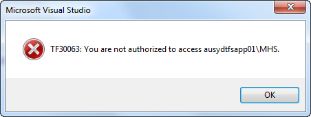
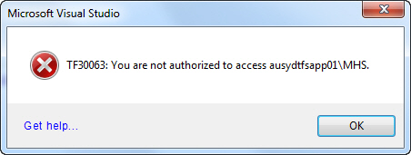

Every message box should contain a link to a wiki or KB with more details about the message. In the example of the below error message:

<!--endintro-->
<dl class="badImage">&lt;dt&gt;&lt;/dt&gt;
<dd>Figure - Bad Example: User now has to Google to find out how to fix this error</dd></dl><dl class="goodImage">&lt;dt&gt;&lt;/dt&gt;
<dd>Figure - Good Example: If you click on the "Get Help..." link on the bottom of the form it will take you to a wiki page with common issues and resolutions</dd></dl>
