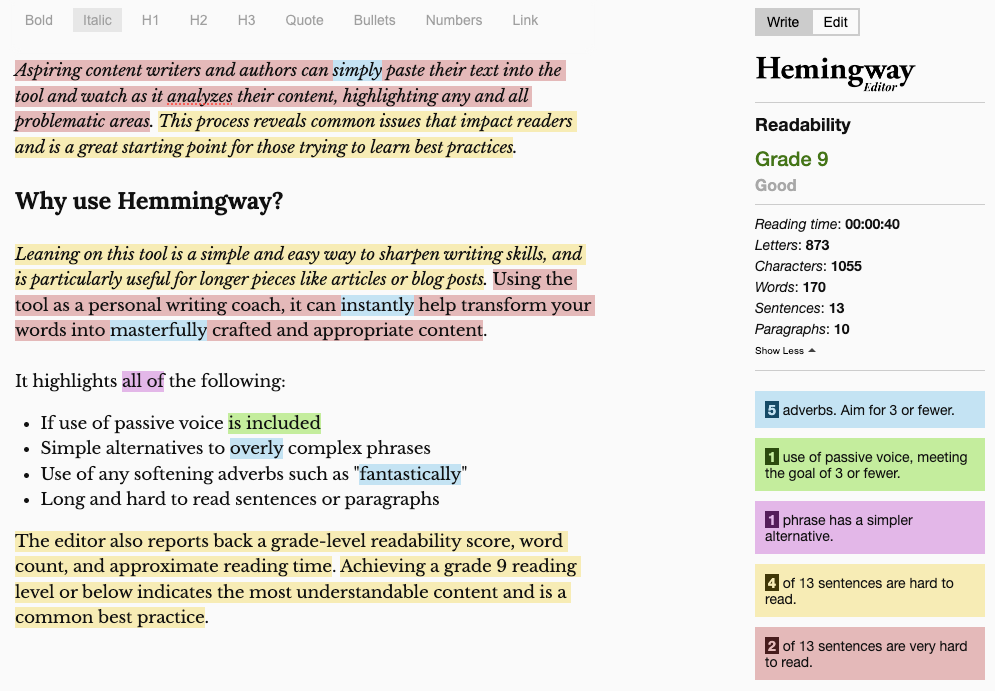
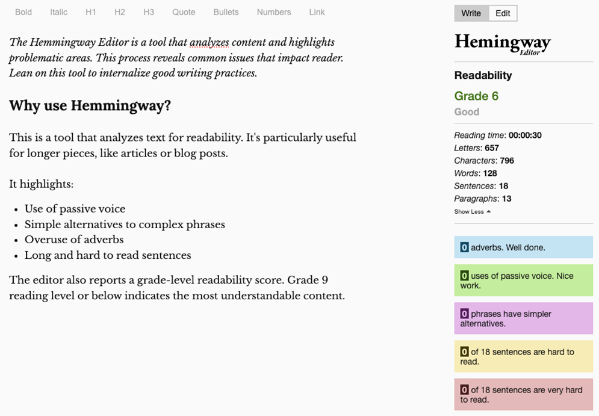

The [Hemmingway Editor](https://hemingwayapp.com/) is a tool that analyzes content and highlights problematic areas. 
This process reveals common writing issues that impact readers. Lean on this tool to internalize good writing practices.

<!--endintro-->
  
## Why use Hemmingway?

This is a tool that analyzes text for readability. It's particularly useful for longer pieces, like articles or blog posts. 

It highlights:
- Use of passive voice 
- Simple alternatives to complex phrases
- Overuse of adverbs 
- Long and hard to read sentences

The editor also reports a grade-level readability score. Grade 9 reading level or below indicates the most understandable content.

## How to use it

Copy and paste content into the editor for immediate feedback. Action as many suggestions as possible, and try to achieve that grade 9 readability or better. 

::: bad  

:::

::: good  

:::
