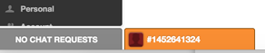
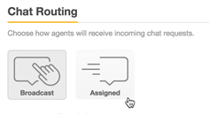

Specify how incoming chat requests are sent to agents with Chat Routing settings. There are two options for how incoming chats are sent to your agents:

* **Broadcast** : All agents get notified of all relevant chats, and the agent has to click on Serve Request to start serving the chat. This is the default setting.
* **Assigned** : Chats are evenly assigned amongst online agents, such that only one agent is notified of each incoming chat at any time.

<!--endintro-->

Incoming chats are assigned to the agent currently serving the lowest number of chats. If multiple agents are tied for the lowest number, the chat is randomly assigned to any one of those agents.

Assigned chats appear in animated tabs at the bottom of the dashboard.

  

**To change the chat routing method for your account**

1. From the dashboard, select  **Settings** &gt;  **Account** &gt;  **Chat Routing** tab.
2. Select a routing method.
  

3. Click  **Save Changes** .
