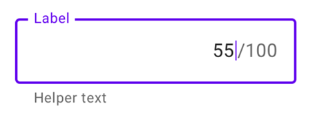

There are different ways to align your form labels and each has its own pros and cons.

<!--endintro-->

### Top aligned

  

::: good
Pros:

:::

* Easiest to process
* Fastest completion times
* Good for multiple languages

::: bad
Cons:

:::

* Takes up a lot of vertical space!
* Makes a long-form look even longer!

### Left aligned

  

::: good
Pros

:::

* Easy to scan labels, especially if you have a lot of optional labels
* Takes a little more attention to fill in, so useful for complicated forms that require accuracy

::: bad
Cons

:::

* Horizontal space, unlike vertical space, is not limitless, and an unintended horizontal scrollbar is the first sin of web development.
* Slowest completion times
* Poor multilanguage support
* Not even very good responsive support

### Right aligned

  

::: good
Pros

:::

* Best at linking label and form
* Good completion rates on small, common forms (i.e. Login, Sign up)

::: bad
Cons

:::

* Hardest to read and scan
* Poor multilanguage support
* Poor responsive support

### Material labeling

Alternatively, we can use Material labeling which places them inside the form and slides up on focus.

  

::: good
Pros

:::

* Best for readability
* Best for visual connectivity
* Best for completion rates
* Decent multilanguage support
* Decent responsive support

::: bad
Cons

:::

* Extremely time-consuming to implement. Need to consider the cost/benefit.
* Not necessarily available on 3rd party platforms, like Wufoo or Microsoft Forms.
