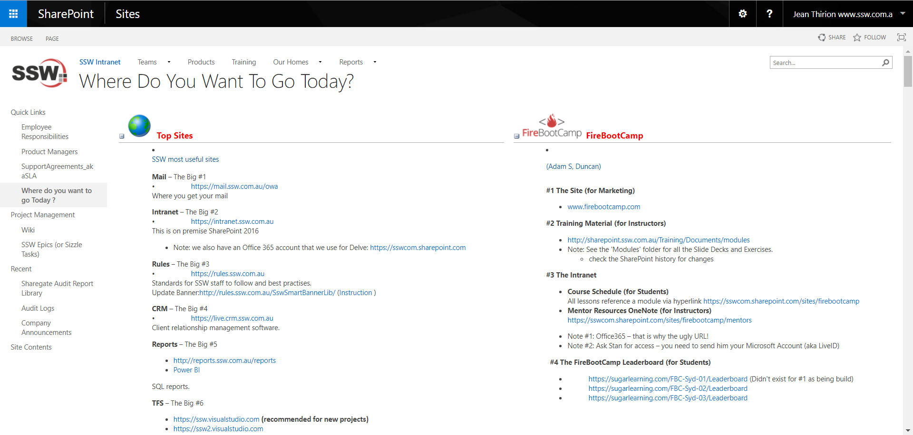
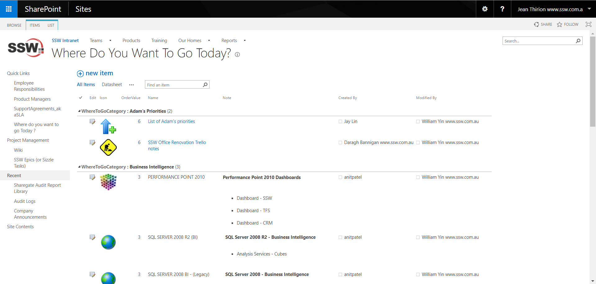

There are certain features in SharePoint on-premises that are no longer supported with SharePoint Online.

If you migrate using the Sharegate migration tool, you want to have zero errors in their reports. To do so, here are what you should do before considering migration:

<!--endintro-->

- Get rid of SharePoint Designer customizations on List form

::: bad  
  
:::

::: good  
  
:::

Remove unsupported columns such as:

- Publishing HTML
- Publishing Hyperlinks
- Calculated Columns with volatile functions ('Me', 'Today'…)
- Managed Metadata columns on folders
- Get rid of MicroFeed

::: bad  
  
:::
