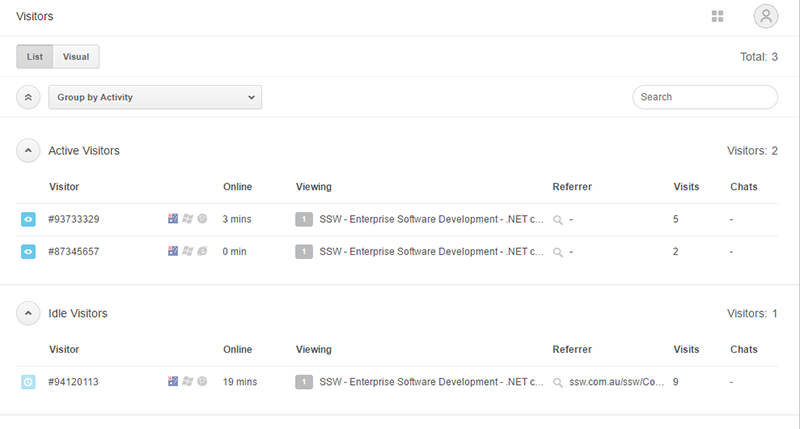
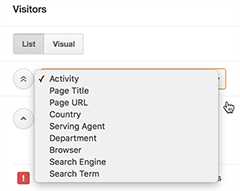
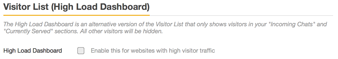

in the Chat section, w​ith the Visitors activity, you can see is a real-time list of all the visitors currently on your website. It helps summarize all visitor information at a glance, including information about their browser, operating system, location, pages visited, and referral page.  

 <excerpt class='endintro'></excerpt> 

   <strong>Monitoring your website visitors </strong>

The Visitors activity gives you a birds-eye view of all the visitors on your website by putting them into different categories: 
   
<dl class="image"><dt></dt></dl><ul><li>
      <strong>Incoming Chats: </strong>Visitors who have clicked the chat button and asked a question.</li><li>
      <strong>Chat Button Clicked: </strong>Visitors who have clicked the chat button but have yet to start a chat.</li><li>
      <strong>Trigger Activated: </strong>Visitors who have activated a trigger.</li><li>
      <strong>Currently Served: </strong>Visitors who are being currently served by other agents or yourself.</li><li>
      <strong>Active Visitors: </strong>Visitors who are moving around the website and clicking on links.  
       </li></ul>
Click the <strong>List </strong>tab<strong> </strong>to view visitors in a list, as shown above, or click <strong>Visual</strong> to see visitors in visual mode.​  

   <strong>Grouping visitors </strong>

This is the primary view of the Visitor List, but you can also monitor them in a number of different ways:
<dl class="image"><dt>
   </dt></dl><ul><li>
      <strong>Activity:</strong> This is the default page and breaks down visitors based on the actions they have taken on your website.</li><li>
      <strong>Page Title:</strong> Groups visitors based on the page they are on.</li><li>
      <strong>Page URL:</strong> Groups visitors based on the URL/link they are on. This is normally different from the Page Title.</li><li>
      <strong>Country:</strong> Groups visitors based on the country they are from. The visitor's IP address tells us which country they are from.</li><li>
      <strong>Serving Agent:</strong> Groups visitors based on the agent who is serving them.</li><li>
      <strong>Department: </strong>Groups visitors based on department. </li><li>
      <strong>Browser:</strong> Groups visitors based on the browser they are using to access your website.</li><li>
      <strong>Search Engine:</strong> If the visitors arrived at your website through a search engine (e.g. Google), they will be grouped under this category.</li><li>
      <strong>Search Term: </strong>If the visitors typed in a search term to get to your website, they will be grouped in this section based on the term they used. 
       </li></ul>

   <strong>Using the High Load Dashboard (Premium)</strong>

If you experience higher traffic (5000 or more concurrent visitors), you can switch to the High Load Dashboard. 
    

Unlike the standard Visitor List, the High Load Dashboard only shows Incoming and Currently Served chats.   

   <strong>To enable the High Load Dashboard</strong>
<ol><li>From the dashboard, go to <strong>Settings </strong>&gt; <strong>Account</strong> &gt; <strong>Visitor List </strong>tab.</li><li>Select the <strong>High Load Dashboard </strong>check box.  
      <dl class="image"><dt>​ </dt></dl></li><li>Click <strong>Save Changes</strong>.</li><li>Return to the Dashboard and verify that only Incoming and Currently served chats appear.</li></ol>

    

