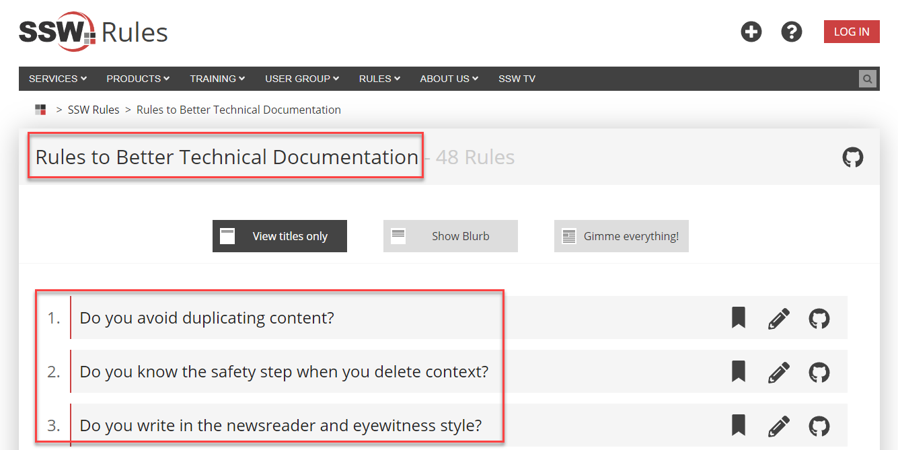

It's important to use correct capitalization when writing titles/headings for web content. For main titles, you should capitalize the first word, all nouns, all verbs (even short ones, like "is"), all adjectives, and all proper nouns. Leave subtitles in normal sentence form.

You can find more rules & tips on capitalizing here: <!--StartFragment-->

[How to Capitalize Titles and Headings Correctly](https://editorsmanual.com/articles/capitalizing-headings/#:~:text=Here%20are%20the%20general%20rules%20for%20capitalizing%20headlines,element%20of%20a%20hyphenated%20term.%20...%20More%20items)

<!--endintro-->

::: greybox
"The Lord of the rings – Return of the king"
:::
::: bad
Figure: Bad example for titles - Inconsistency on words' capitalization
:::

::: greybox
"The Lord of the Rings – Return of the King"
:::
::: good
Figure: Good example for titles - Only conjunctions and prepositions (both having similar rules) should not be capitalized. E.g. "at", "on", "but", "and", "with", etc
:::

It's best to only do this on main titles, and leave subtitles in normal sentence form - only capitalize the first word and proper nouns. Basically, it saves hassles... English is a confusing language, and there are too many variations that cause too many arguments.

::: good

:::
