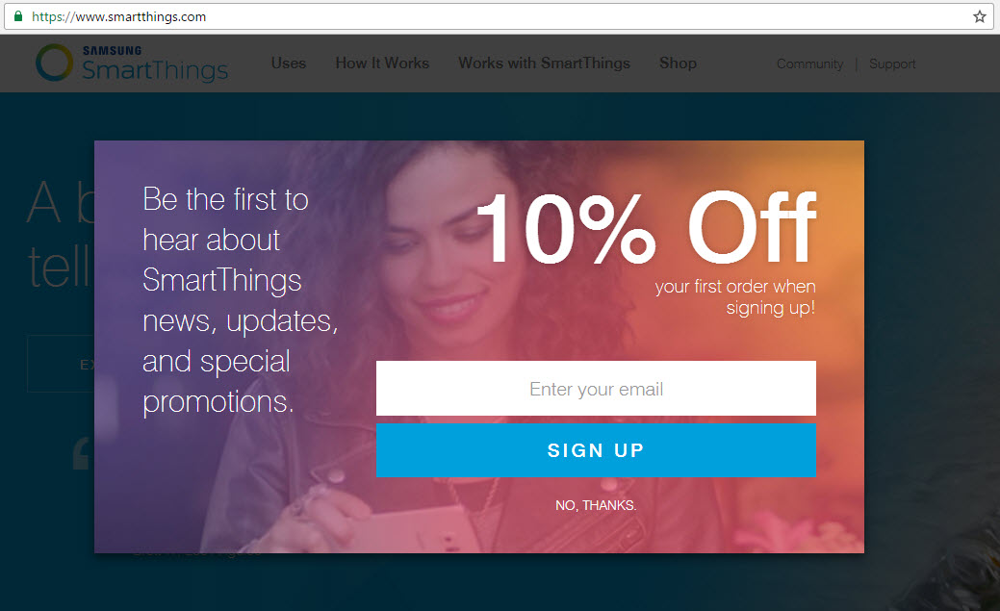

When a user enters your website for the first time, they should be encouraged to give their email address.

<!--endintro-->

* **Offer incentives** – Discounts, free guides, or exclusive access increase sign-up rates because people feel they’re getting immediate value
* **Create a seamless sign-up experience** – Short, easy-to-complete, and visually appealing forms reduce friction and boost completions
* **Use well-designed popups** – With good timing, clear calls to action, and mobile-friendly design, popups can be highly effective without being intrusive
* **Balance is key** – Combine relevant incentives, smooth experience, and respectful timing to collect more (and better) email addresses

::: good

:::
