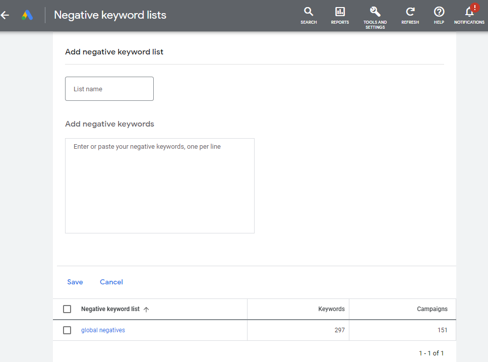

It’s important to create specific negative keyword lists depending on your business, you can have lists named “cheap” or “career” related. Or you can also have a global that would be applied to all your campaigns. It’s important to do this on a weekly basis. 

<!--endintro-->

To do that, click on “Tools and Settings” on the top right, then on “Shared Library”, click on "Negative keyword lists". 

You can then create the title for your list and add the keywords you think might help you either: save some money from non-targeted clicks or improve your results to get you the right audience. 

Depending on your industry, we recommend having a global keyword list, as this is easier to manage.

