This is how you created a rule in SharePoint.

<!--endintro-->

1. Log in to /admin

2. Click on “Add a page”
  
  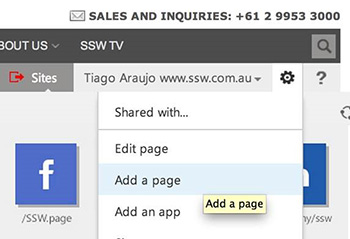  
  
  **Note:** Each rule will be a “page” on SharePoint – with its own URL - differently from old aspx, where rules were sections on a single page.

3. Add the URL
  
  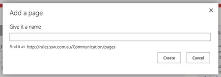  
  
  **Note:** We use only the most important words of a rule title.
  
  **Note:** Friendly URL should be automatically generated like:
  
  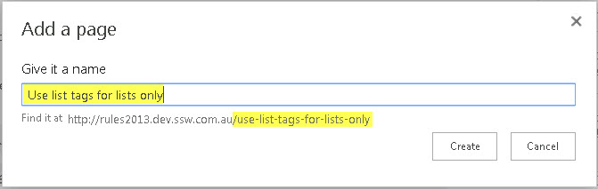

4. Add the rule title
  
  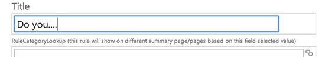

5. Add the rule category (so that it will be shown on the summary page):  
  
  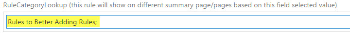

6. **IMPORTANT** – Adding rule intro + content
  
   You have 3 options:

**Option 1** – Start from scratch - Write content down on the fields
**Option 2** - Paste the content from another place - a HTML page on the browser or a Word document  
  **Warning:** Select the “ **Paste Plaintext** ” when pasting or you will have a lot of work later

  ::: bad  
  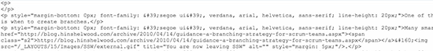  
  :::

  ::: good  
  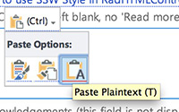  
  :::

  Since you have pasted the plain text, you’ll need to manually add the styling - headings, links, captions etc.

  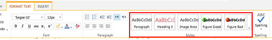  

**Option 3** - Paste the HTML code (recommended if you already have the content in the internet and the HTML is neat enough)

  1. Open up and copy the HTML code (from “view source” on a browser)
  2. Go back to SharePoint (where you are adding the rule)
  3. Click in the field you are going to edit
  4. In the “Format Text” ribbon, click “Edit Source”

  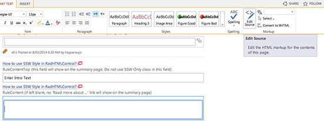  

  5. Paste the HTML there

  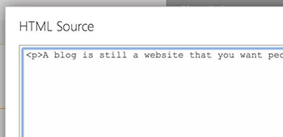  

  6. Now fix up the images – This part is a bit painful

* Firstly you will need to save all the images to your local drive
* We don’t use the "Insert &gt; Picture" on the ribbon because it doesn’t generate the HTML code we use as default as per [Do you use the right HTML/CSS code to add the useful figure/caption?](/use-the-right-html-figure-caption)
* Instead, upload them to the Images folder - /PublishingImages/
  * Go to “Site Contents”
  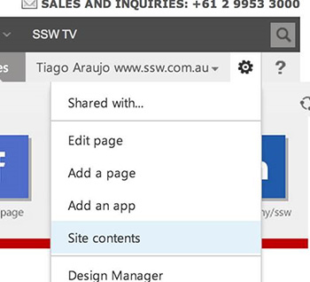  

  * Click on “Images”
  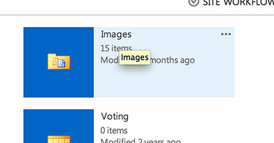  

  * Drag the images from your local drive to the Images folder in SharePoint:
  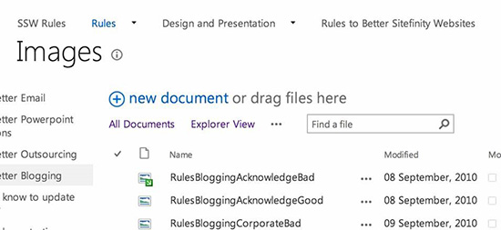  

  * Make sure you “Check In” all the images (otherwise they won’t be visible for anonymous users)
  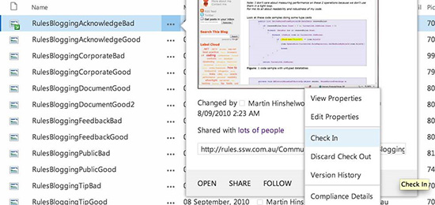  

* On the screen above you can see the path for each image. Copy it so you can paste into the HTML.

  8. Double check the links – you might have got a relative link E.g.  **&lt;a href=”<mark>../</mark>company/Offices.aspx”&gt;** which will not work because it’s now on a different site.
  So you will need to make it absolute E.g.  **&lt;a href=”** [**<mark>http://www.ssw.com.au/</mark>ssw/company/Offices.aspx**](http://www.ssw.com.au/ssw/) **”&gt;**

  9. Add the rule intro

  Try to have a catch at the end so the user will want to read the rest of the rule. E.g. “ To reply to a bug effectively and efficiently in your emails, you need to include:”

  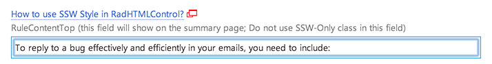  

  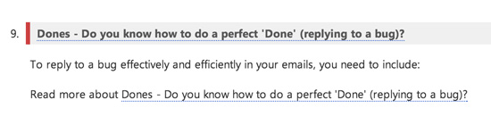  

  10. Add the rule content
  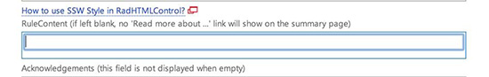  

  11. [Add the acknowledgements](/do-you-add-acknowledgements-to-every-rule)
  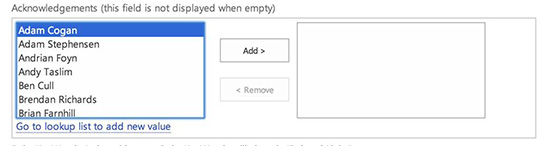  

  12. Hit “Publish”, add your comments and “Continue”
  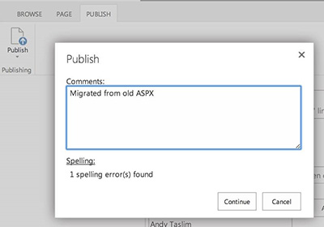  
      **Note:** "Check in a major version"  **equals** "Publish", so you can choose to "Check in a major version" instead of "Publish".

  13. Test on a browser you aren’t logged in.
    **Tip:** In Chrome, select “New Incognito Window”
  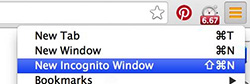  

  14. Check on the summary page (e.g. RulesToBetterSomething/ ) if the order is correct

  If not it’s not correct, you can change the order of rules by following the instructions as per the section below:

  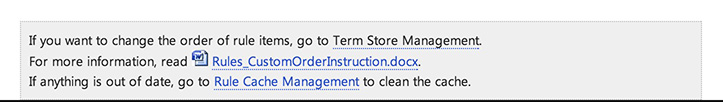  
  **Tip:** You might need to refresh the cache – See “Rule Cache Management” also on the section above.

Congratulations, you’ve just added a rule!

To increase traction in the community you should tweet it:

::: greybox
E.g. “I just added a rule on \[link\] #SSWRules”  
:::
