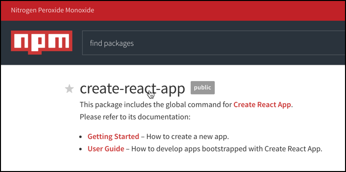

Create-React-App is a boilerplate provided by Facebook for almost any React project. Create React App is an officially supported way to create single-page React applications. It offers a modern build setup with no configuration.

<!--endintro-->

::: good  
  
:::

1. Install [Create-React-App](https://github.com/facebook/create-react-app)
2. Quick Start

  ``` jsx
  npx create-react-app my-app
  cd my-app
  npm start
  ```

3. Open your Application **localhost:3000**

**Note:** [npx](https://medium.com/@maybekatz/introducing-npx-an-npm-package-runner-55f7d4bd282b) comes with npm 5.2+ and higher, see [instructions for older npm versions](https://gist.github.com/gaearon/4064d3c23a77c74a3614c498a8bb1c5f).

See [Gatsby starter kits](https://www.gatsbyjs.com/starters/) to create static websites with React. It lets you use React components, but outputs pre-rendered HTML and CSS to guarantee the fastest load time.
