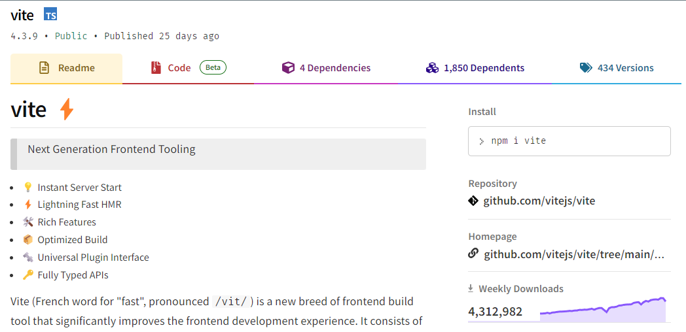

The old standard way to start a React project, create-react-app is [no longer actively supported by Facebook](https://github.com/facebook/create-react-app/discussions/11086#discussioncomment-956516), and has been removed from the official developer documentation (https://react.dev/learn/start-a-new-react-project). Therefore, it is not the best choice for starting a client-side rendered React app. 

<!--endintro-->

## Vite

Vite is a reliable frontend build tool for building fast and optimised frontend web apps that has easy integration with a wide range of frontend web frameworks, and built-in Typescript support.  

Vite is much faster than using create-react-app, mainly because Vite does not use Webpack for bundling assets. It instead uses esbuild and Rollup, which are much faster and more modern tools for building great frontend web apps. 

::: bad

:::

::: good

:::
**Note:** Vite requires Node version 14.18+ or 16+. 

1. Run:

```shell
npm create vite@latest 
```

2. Enter the name of your project
3. Select "React" from the list of frameworks


4. Then, select the "TypeScript" variant from the list


5. All done! Now navigate into the directory and run the app with the following commands:

```bash
cd {{ PROJECT_NAME }}
npm install 
npm run dev
```


## NextJS 
As per the official React docs (https://react.dev/learn/start-a-new-react-project), the recommended way to start a new React project is with NextJS. 

It is recommended in NextJS official docs (https://nextjs.org/docs/pages/api-reference/create-next-app) to start a new NextJS project by using:
```shell
npx create-next-app@latest
```

Developers can then manually choose how they want to set up their NextJS app.

## Gatsby 
As per the Gatsby docs (https://www.gatsbyjs.com/docs/quick-start/), the most effective approach to start a new Gatsby site is by executing the following command:
```shell
npm init gatsby
```
Through the provided prompts, you can also select your preferred language (JavaScript or TypeScript), CMS, and styling system that you intend to use.
