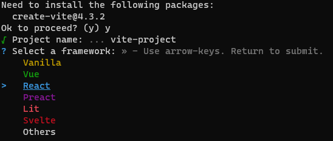
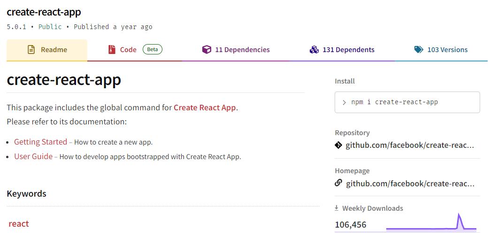

## Vite

Vite is a reliable frontend build tool that has an easy integration many frontend web frameworks, and built-in Typescript support.  

Vite is much faster than using create-react-app, this is mainly because Vite does not use Webpack for bundling JS assets. 

::: good

:::
**Note:** Vite requires Node version 14.18+ or 16+. 

1. Run:

```shell
npm create vite@latest 
```

2. Enter the name of your project
3. Select "React" from the list of frameworks



4. Then, select the "Typescript" variant from the list


5. All done! Now navigate into the directory and run with the following commands:

```bash
cd {{ PROJECT_NAME }}
npm install 
npm run dev
```
## Create React App

Create-React-App is a good boilerplate for almost any React project. It offers a modern build setup with no configuration. 

**Note:** Create-React-App is [no longer actively supported by Facebook](https://github.com/facebook/create-react-app/discussions/11086#discussioncomment-956516), and is not the best choice for starting a client-side rendered React app. 

<!--endintro-->

::: good

:::

1. Install [Create-React-App](https://github.com/facebook/create-react-app)
2. Quick Start

```shell
npx create-react-app my-app
cd my-app
npm start
```

3. Open your Application **localhost:3000**

**Note:** [npx](https://medium.com/@maybekatz/introducing-npx-an-npm-package-runner-55f7d4bd282b) comes with npm 5.2+ and higher, see [instructions for older npm versions](https://gist.github.com/gaearon/4064d3c23a77c74a3614c498a8bb1c5f).
## NextJS

## Gatsby

See [Gatsby starter kits](https://www.gatsbyjs.com/starters/) to create static websites with React. It lets you use React components, but outputs pre-rendered HTML and CSS to guarantee the fastest load time.