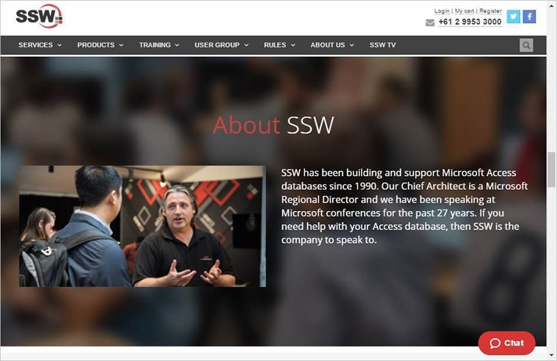

Zendesk support agents can have chat enabled, allowing them to answer chats from the website.​​ 

 <excerpt class='endintro'></excerpt> 
<dl class="image"><dt>​​​Figure: the chat icon in the bottom right of the page can be available on any part of your site</dt></dl><dl class="image"><dt></dt><dd>Figure: clicking on it brings up this form, allowing capture of customer data and conversation</dd></dl>
To enable this, navigate to 
   <b>Admin</b> (cog) | 
   <b>People</b> | 
   <b>&lt;Agent’s name&gt;</b> | flick the “<b>Zendesk Chat</b>” switch: 
   
   
<dl class="image"><dt></dt></dl>
<strong>Note:</strong> Be aware that this requires a chat license, so should only be enabled for people who will be doing it.​ 

