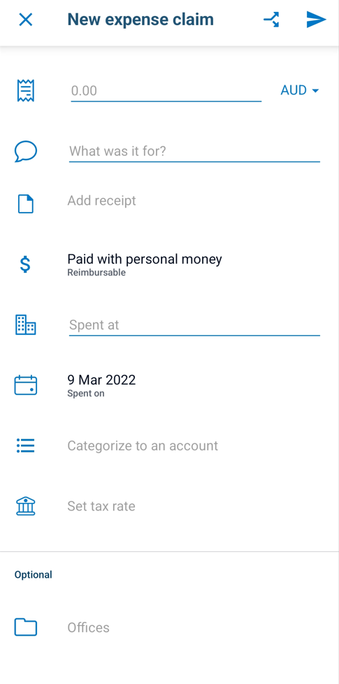
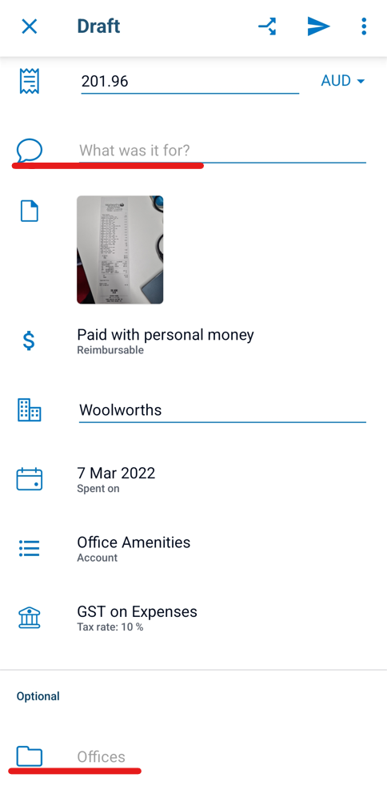
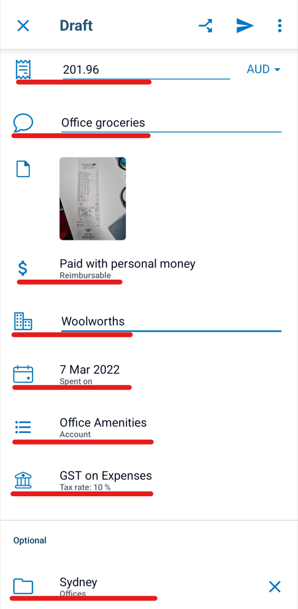
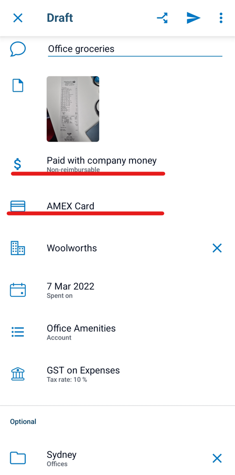

Xero Me is a comprehensive tool that combines expense claims with Xero payslips and leave entitlements.

<!--endintro-->

To avoid confusion, add as much relevant details as possible into the subject field, e.g. "Scrum Master course - only 50% of this is to be reimbursed".

A detailed step-by-step process on how to enter expense claims in Xero Me from from your phone or desktop can be found [here](https://central.xero.com/s/article/Create-a-new-expense?userregion=true#android).

Xero Me has a smart scan function which will read the amount, supplier name and invoice date directly from the invoice. The subject field ("What was it for?"), reimbursable field, categorize field and office field will need to be added in manually.

::: bad

:::

::: good

:::

If the expense is not reimbursable, i.e. has been paid on the company's credit card, tap on the "Paid with" field and change it to "Paid with company money" and change the bank account/credit card field to either Amex or Citibank.

