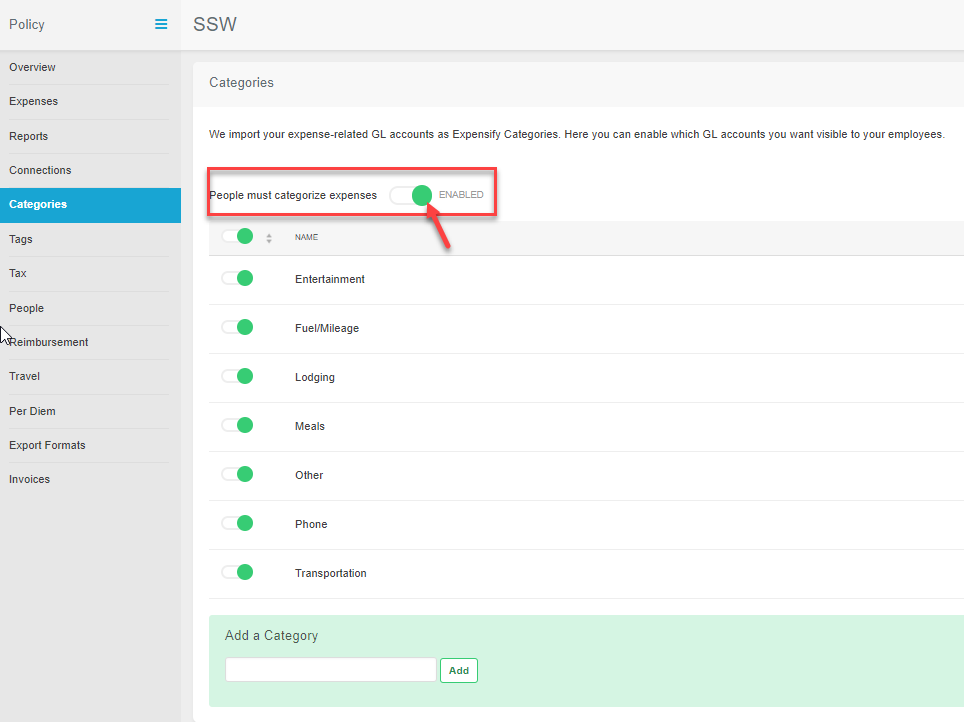

Expensify is great for tracking receipts, but if you don't use it in the right way the reports can be hard to reconcile.

To avoid confusion, add as much detail as possible about the purchase and who authorized it. To make this easier, your company can set some required fields to ensure that you have all of the relevant data entered for each claim. This will make your claims a lot more unified and easier to process. 

<!--endintro-->

For example, on the free version of Expensify, you can make the "Category" field a required field by switching the option to enabled.

More features are available if you purchase the full version, and you can see these options on their [pricing features page.](https://www.expensify.com/pricing#features)

  

Required fields are then identified by an asterisk when you are uploading an expense. Conveniently, most of this information is completed for you by the Smart Scan function.  On the free version, there is still room to add a manual "Comment" for more complicated claims if required.

::: bad  
  
:::

::: good  
  
:::

If you complete these fields, it will make your reports much nicer to read and easier to claim.

::: good  
  
:::
