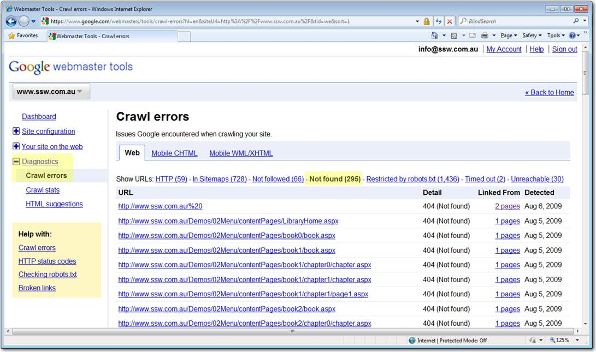
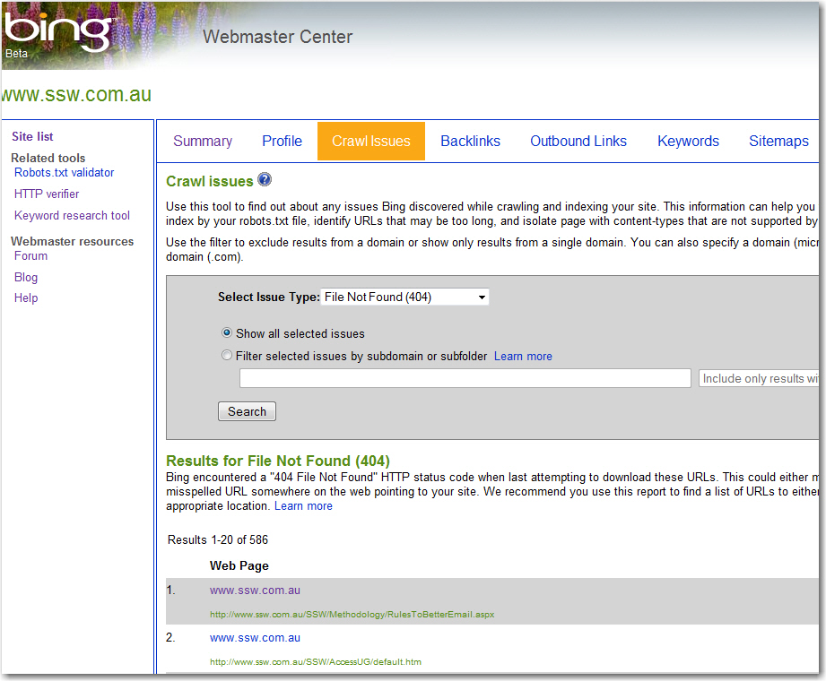
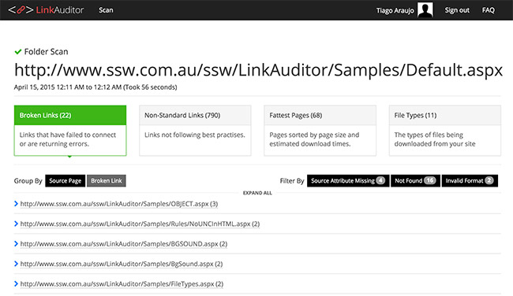

Often times, web pages are dynamic. Most link scanners are not capable of submitting form information. The trick is to allow a "door" for link scanner go through to scan a dynamic section of a site. A common technique is to hard code hidden link with a query string at the bottom of the page that allows the link scanner to follow into the simulated user input. See the following code for example: 

<!--endintro-->


``` html
<a href="KB.aspx?KBID=Q1097707">Q1097707 - How do I turn Option Strict on by default in VB.NET?</a>
```
**Figure: Example source code - finding broken links**

It will return all the knowledge base articles in a paged format. The link scanner will click the Next Page link and eventually scan through the entire knowledge base.

[Google webmaster tools](https://www.google.com/webmasters) and [Bing webmaster centre](http://www.bing.com/toolbox/webmaster/) are useful tools to monitor links.

  

  

We have a program called [SSW Link Auditor](https://sswlinkauditor.com/) to check for this rule.


