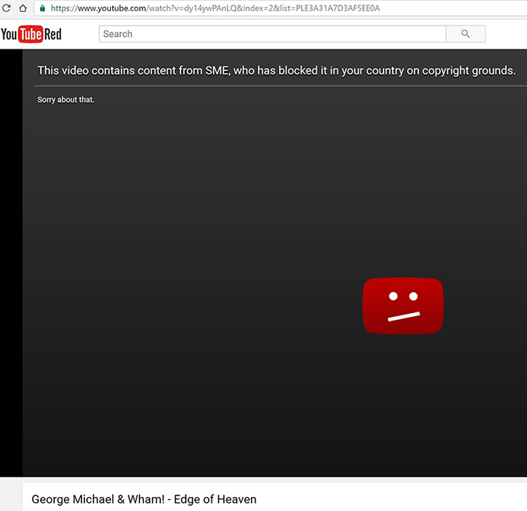
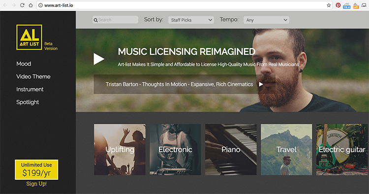
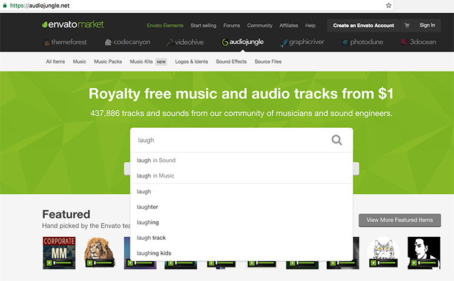

Finding the right song or music for your video is exciting, but you should never use any copyrighted work without permission. This is because copyright is designed to protect musicians and creators, so using unlicensed music negatively affects artists. 

In addition to this, if you have unlicensed or copyrighted music or songs on your YouTube videos they might be removed from the site or and revenue will instead be distributed to the artist. To avoid this, use **licensed** or **royalty-free** music. 

<!--endintro-->

::: bad\

:::

## Royalty-Free Music

There are many options available for purchasing high-quality music that you can use in both commercial or personal videos.

Some of the top music libraries are:
- [Audio Network (recommended)](https://au.audionetwork.com/)
- [Artlist](https://artlist.io/)
- [Audio Jungle](https://audiojungle.net/)

### Audio Network
Audio Network is the best option for editing because it provides a very large range of very high quality music, and even offers variations on instrumentation and durations. The user interface is good, and customer service is great too, with an Account Manager available to assist.  This library is used by major production companies and broadcasters around the world (UK based).

::: good

:::

### Artlist
Artlist have a regularly updated library with new songs, and is a very cost-effective solution. While the library of music is more limited than Audio Network, they also provide a subscription to sound effects which is very useful. The style sounds more like professional music created by bands and artists but is still designed for corporate, making it a solid choice as a music library.
::: good\

:::

### Audio Jungle
Audio Jungle is great for finding sound effects and [Foley](https://en.wikipedia.org/wiki/Foley_%28filmmaking%29) sounds. You can also find many great full-length songs that suit corporate video. The music style is typically geared toward a "corporate" market (e.g. online ads and marketing videos), so there is not as much range in selections as you would find in some of the bigger libraries.

::: good\

:::

