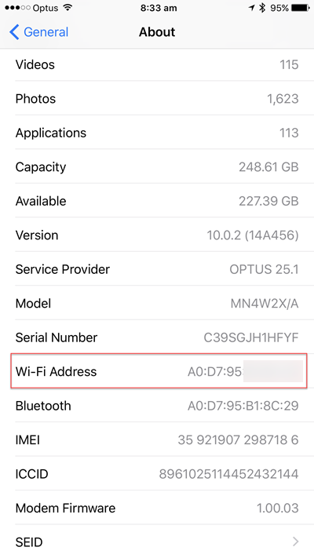
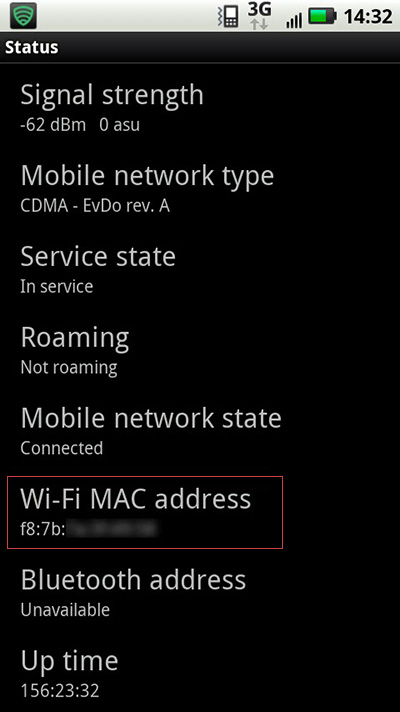

To help with automation (e.g. [SophieBot](https://sswsophie.com/sophiebot/)) you can use the MAC address of your mobile device to match when it joins the company Wi-Fi. This allows you to:

* Automatically log when you come in or out (See [Do you know the best way to see if someone is in the office?](/the-best-way-to-see-if-someone-is-in-the-office)) 
* Announce your presence to the rest of the office
* Get statistics and analytics: E.g. Who travels the most? Or which city uses In-And-Out the most?   
  ::: todo
  **TODO: Uly**
  :::

::: greybox
Learn more about [SSW SophieBot AI and its feature of employees' presence check on SugarLearning](https://my.sugarlearning.com/SSW/items/12973/smart-office-ssw-sophiehub-and-ssw-sophiebot).
:::

Here is how to find your MAC address:

<!--endintro-->

### iPhone

1. Open the  **Settings** app
2. Navigate to  **General | About**
3. Look for  **WiFi Address**

  

### Android Phone

1. On the Home screen, tap the Menu button and go to  **Settings**
2. Tap   **About Phone**
3. Tap   **Status/Hardware information**
4. Scroll down to see your  **WiFi/MAC address**

  
