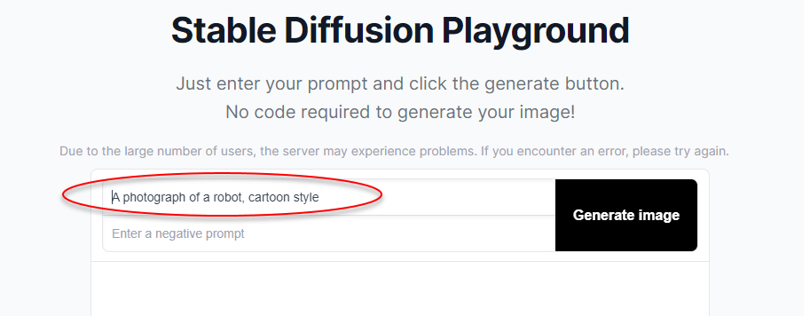

Imagine you’re browsing through an art exhibition online and you come across some strikingly unique images. Upon reading the descriptions, you realize they were all generated using Artificial Intelligence (AI). This piques your interest, and you find yourself wondering, "Could I create something like this?" The answer is yes. Here is how you can do it yourself.

<!--endintro-->

`youtube: https://www.youtube.com/embed/zf4z8A-OWBY`
**Video: How To Generate INSANE AI Art For Beginners (2 min)**

Note: Midjourney is no longer free as it was in this video demo.

## How AI Image Generation Works

AI image generators are tools that utilize trained AI models to create new images. The models are trained on databases of existing artwork. The [most popular AI image generators](/the-best-ai-image-generators) are Midjourney, DALLE-2, and StableDiffusion.

These image generators work by reading your text and using it to create an image. The text you input is called a ‘[prompt](/write-an-image-prompt)’, and it guides the model towards the type of image that you describe.

Each AI image generator works slightly differently, but the basic idea is the same: text ➡️ image.

### Generating Your First AI Image

The exact process will vary depending on the generator you're using, but generally, you can follow the following steps:

1. Navigate to the generator’s interface.
2. Write a short description of the image you want
(optional: include a [negative prompt](/use-negative-prompting) (specifying what you DON’T want in the image)
3. Generate the image: The tool will create an image based on your specifications.

::: good

:::

### Practice makes perfect

The more you experiment, the better you'll understand how different inputs affect your results. Try new things and make mistakes – it's all part of the learning process!
