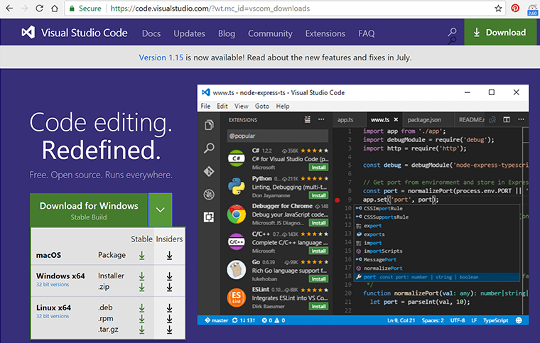
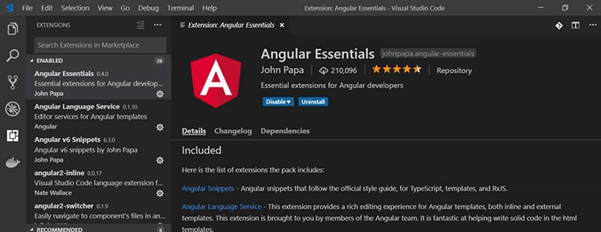
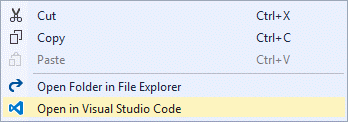

​​​​When developing Angular or React, there are lots of choices for code editors. The best experience by far is to use <a href="https://visualstudio.microsoft.com/downloads/">Visual Studio Code</a>.    
 <excerpt class='endintro'></excerpt> 
<dl class="goodImage"><dt> 
       
   </dt><dd>Figure: Good Example - Visual Studio Code is a free, lightweight IDE that runs on Windows, Linux and OS X. Visual Studio Code is the IDE of choice for many Angular developers and has lots of great extensions for Angular </dd></dl>
Many experienced teams are using Visual Studio for their C# backend and loving using Visual Studio Code for their Angular or React projects.

The recommended extension for Visual Studio Code is `<strong>Angular Essentials</strong>` from John Papa​ 

 
   <strong>Angular Essentials </strong>is actually a meta-package that includes a list of great extensions for Angular Development – and this list may be updated in the future as more extensions become popular. 

See 
   <a href="https://github.com/johnpapa/vscode-angular-essentials">https://github.com/johnpapa/vscode-angular-​essentials</a>. 
<dl class="goodImage"><dt> 
       
   </dt><dd>Figure: Good Example – the Angular Essentials extension will install a great suite of extensions to support Angular development</dd></dl>
You can find more extensions at <a href="https://marketplace.visualstudio.com/">Visual Studio | Marketplace</a>. 
<h3>​Open in Visual Studio Code</h3>
This extension is for those times where you have a project open in 
   <b>Visual Studio</b> and you want to be able to quickly open it in 
   <b>Visual Studio Code</b>. 
<dl class="image"><dt>
      
   </dt><dd>Figure: Get to Visual Studio Code quickly from within Visual Studio - 
      <a href="https://marketplace.visualstudio.com/items?itemName=MadsKristensen.OpeninVisualStudioCode">Open in Visual Studio Code extension</a>​ </dd></dl>
 
   <b>More: </b><a href="https://stackshare.io/posts/why-developers-love-visual-studio-code">Why do others love VS Code?​</a> 

