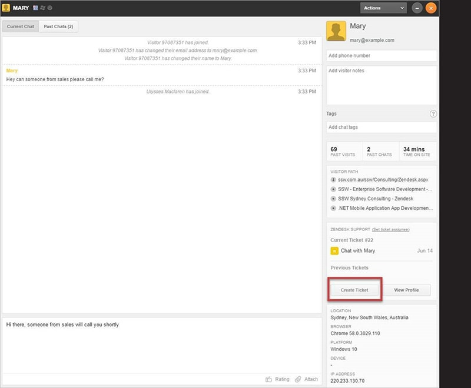
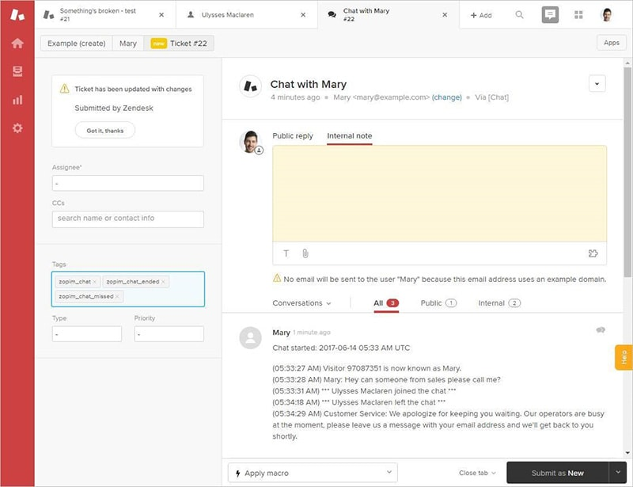

If you’re chatting with a client on Zendesk chat, and you realize you’re going to need to involve someone else, such as a salesperson, you can create a support ticket and assign it either to a sales group, or else a specific person.

 <excerpt class='endintro'></excerpt> 
<dl class="image"><dt></dt><dd>Figure: Chatter can create a ticket directly from the chat window</dd></dl><dl class="image"><dt></dt><dd>Figure: ticket is then created with chat history appended</dd></dl>
<strong>Note:</strong> You can also integrate with Dynamics 365 (AKA CRM) to pass over lead details from Zendesk straight to a Dynamics 365 lead. 

