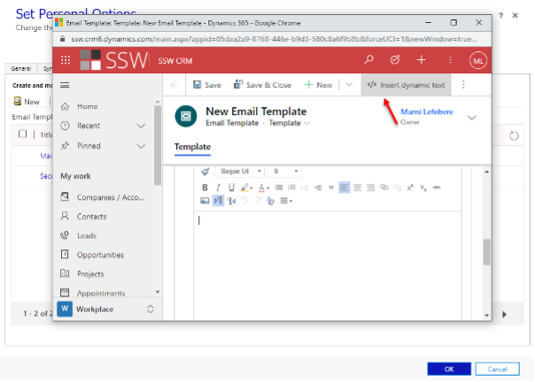
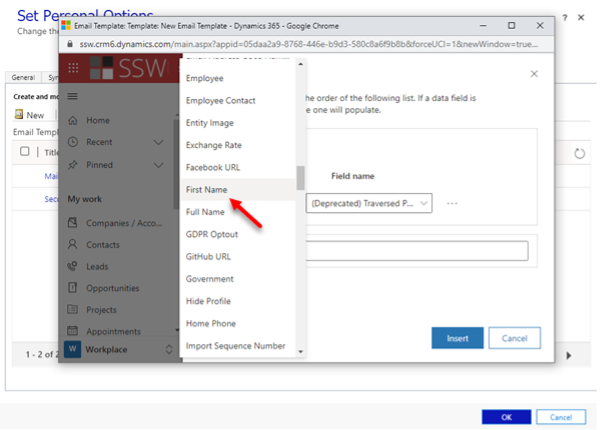

While editing your mail merge template, you can add a Dynamics data field in the document. For example, you can add the contact's first name.

<!--endintro-->

1. When you’re editing or creating a new email template, in the subject or body of the email template select </>Insert dynamic text
  

2. Leave the Record type as User, and then select the Field name of your choosing (for example, first name)
  

3. If you want Dynamics to insert static text when none of the fields you have specified contain any data, in the Default text box, type the text that you want Dynamics to display instead of a dynamic value

4. Finish editing your template, save it, and upload it to Microsoft Dynamics 365
