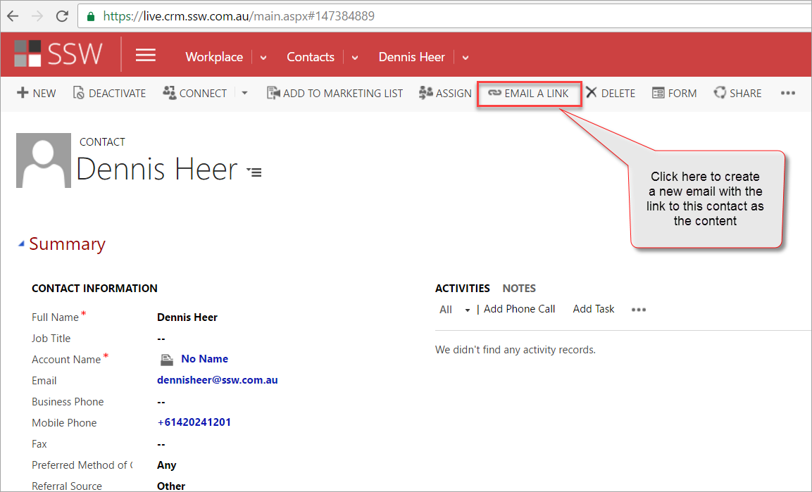
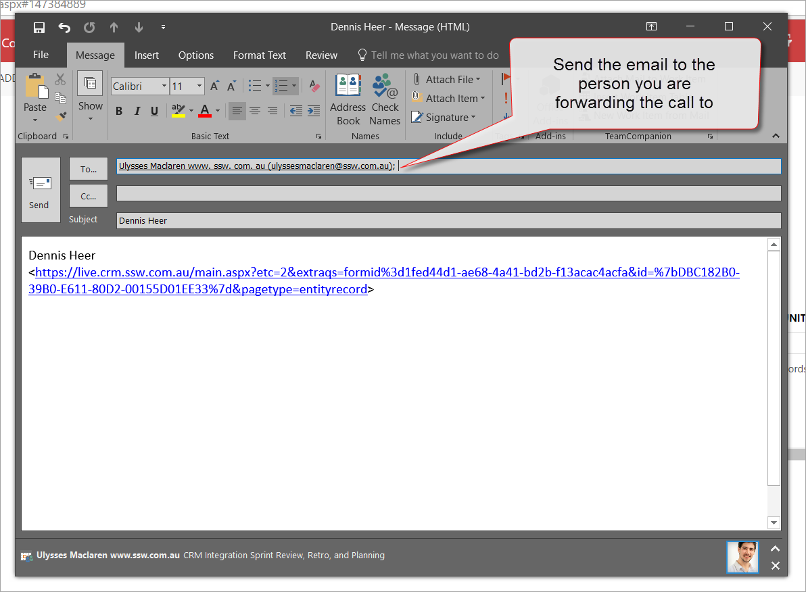
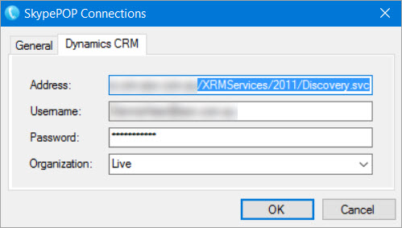
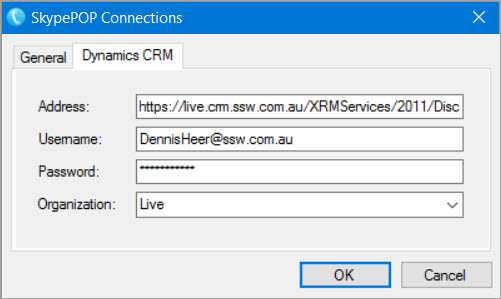
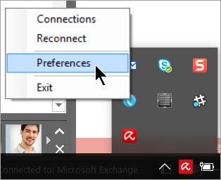
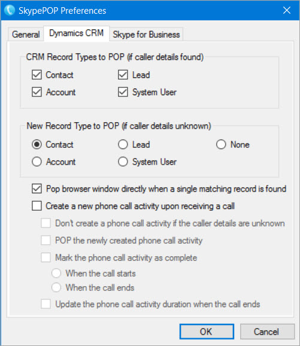

​​​​​​​​​​​​​​​​​​​​​​​​​​​​​​​​All company receptionists should install SkypePOP ​on your PC.   This will enable you to get Dynamics CRM contact popups on incoming calls, for example: 
<ol><li>Bob Northwind calls you  </li><li>His CRM contact will open up in your browser (by default before you pickup) </li><li>You now know exactly what you last talked about​ (by looking at the recent Activities and Opportunities) </li></ol>

There is one limitation to SkypePOP - fo​rwarded calls won't give you useful information, as SkypePOP will show you the contact details of the person forwarding the call, not the external client. ​​That's why we recommend using SkypePOP the following way:​​​​​​​  

 <excerpt class='endintro'></excerpt> 

Only receptionists should have SkypePOP installed. 

1.      An incoming call is taken by the receptionist 

2.      The CRM contact pops up (or a "new contact" form if the number is not already in your CRM): 
<blockquote style="margin:0px 0px 0px 40px;border:none;padding:0px;"><dl class="ssw15-rteElement-ImageArea"> 
       
   </dl></blockquote><blockquote style="margin:0px 0px 0px 40px;border:none;padding:0px;"><dd class="ssw15-rteElement-FigureNormal">Figure: Example contact popup on our CRM from incoming caller with the number +61420241201 </dd>
​ 
</blockquote> 
​​3.      Send Email​  
<blockquote style="margin:0px 0px 0px 40px;border:none;padding:0px;"><dl class="ssw15-rteElement-ImageArea"> 
       
   </dl></blockquote><blockquote style="margin:0px 0px 0px 40px;border:none;padding:0px;"><dd class="ssw15-rteElement-FigureNormal">Figure: This email will be created – send it to the person you are forwarding the call to </dd></blockquote>
  4.      Inform the person the call is being transferred to that you have sent him an email with the CRM Contact 

5.      Wow! No one has to open the CRM manually anymore​ 
<h3 class="ssw15-rteElement-H3"> 
   
   How to Install SkypePOP</h3>
 ​​  
 ​
<iframe width="682" height="384" src="https://www.youtube.com/embed/5tapdkp1vDg" frameborder="0"></iframe> 
​
 ​​ ​ 

1.      Download and install ​SkypePOP from 
   <a href="http://www.appvnet.com/" target="_blank">the official website​</a> 

Install SkypePOP from our account on the official SkypePOP page​:  <a href="https://www.skypepop.com/my-account/my-api-downloads/"><strong>https://www.skypepop.com/my-account/my-api-downloads/</strong></a> ​[My account | API Downloads | ​Download] Login details are in Keepass (standard generic email + standard convention password)

 
      <strong>Step 1.5: </strong> 
        
       Register ​​​​​​​​your version of SkypePOP by pressing 
      <strong>Preferences </strong>​and entering the following data​: Key: [​​skypepop.com | My Account | ​API Keys]​ Email: standard generic email​​​​ 

 
        
   

2.<strong> </strong>     Open the 
      <strong>Connections​</strong> settings 
<blockquote style="margin:0px 0px 0px 40px;border:none;padding:0px;"><dl class="ssw15-rteElement-ImageArea"> 
          
         ​Figure: Right click on the SkypePOP icon in the taskbar </dl></blockquote>
  

3.      Add your CRM c​onnection details​​​ 
<dl class="ssw15-rteElement-ImageArea">Tip: ​​Go to Main | Settings | ​​Customizations | Developer Resources in order to find the address for your CRM​​​ 
      <dl class="ssw15-rteElement-ImageArea"> 
          
      </dl></dl>
<blockquote>
<dl>
 <strong>Figure: Copy the ​Endpo​int Address ​for your Organization Service​​</strong> 

 
            <strong>
                </strong>

 
            <strong>​​​​​ </strong>

 
            <strong>Figure: Enter your CRM Connection Details  </strong>
</dl>
</blockquote>

The following shows how to connect to SSW CRM:  ·        Address: https://live.crm.ssw.com.au/XRMServices/2011/Discovery.svc ·        Username:  &lt;your-name&gt;@ssw.com.au ·        Password: &lt;your-domain-password&gt; ·        Organization: Live  
      <dl class="ssw15-rteElement-ImageArea"> 
          
      </dl> 
      <strong>​  Figure: Example CRM c​onnection se​ttin​gs​​ (this URL is working, too)​​</strong>

 
          4.      Change the​​ SkypePOP <b>Preferences</b>​ 

<blockquote style="margin:0px 0px 0px 40px;border:none;padding:0px;">
<dl class="ssw15-rteElement-ImageArea"> 
             
         </dl>   Figure: ​​Right click on t​​he icon in the taskbar and select “Preferences”
</blockquote>
<blockquote style="margin:0px 0px 0px 40px;border:none;padding:0px;"> 
           
      </blockquote>5.      Configure the 
      <b>Dynamics CRM</b> settings to something similar to this: 
      <blockquote style="margin:0px 0px 0px 40px;border:none;padding:0px;"><dl class="ssw15-rteElement-ImageArea"> 
             
         </dl></blockquote><blockquote style="margin:0px 0px 0px 40px;border:none;padding:0px;"><dd class="ssw15-rteElement-FigureNormal">​Figure: These are the default SkypePOP settings </dd></blockquote>
  
         
6.      Open Skype for Business

 
          7.      Review the 
         <strong>SkypePOP - Skype for Business</strong> settings 
<blockquote style="margin:0px 0px 0px 40px;border:none;padding:0px;"><dl class="ssw15-rteElement-ImageArea"> 
             
         </dl><dd class="ssw15-rteElement-FigureNormal">Fi​​​gure: These are the default Skype for Business settings </dd></blockquote>
  
         
8.      Ensure both Dynamics CRM and Skype for Business are connected by clic​king on the tray icon​ 

<blockquote style="margin:0px 0px 0px 40px;border:none;padding:0px;"><dl class="ssw15-rteElement-ImageArea"> 
             
              
         </dl><dd class="ssw15-rteElement-FigureNormal">Figure: Check that you ar​​e properly connected - blue is success  </dd><dd class="ssw15-rteElement-FigureNormal"> 
              
         </dd></blockquote>
The SkypePOP demo license will stop working after 5 hours or 5 calls​​ <strong>​​​Tip: Reduce the time used by quitting SkypePOP - you do that by right clicking | Exit on the tray icon</strong>

​​ 
         
9.   ​Restart your PC. 

10. Test with SNOM phone to ​verify SkypePOP​ is working correctly 

