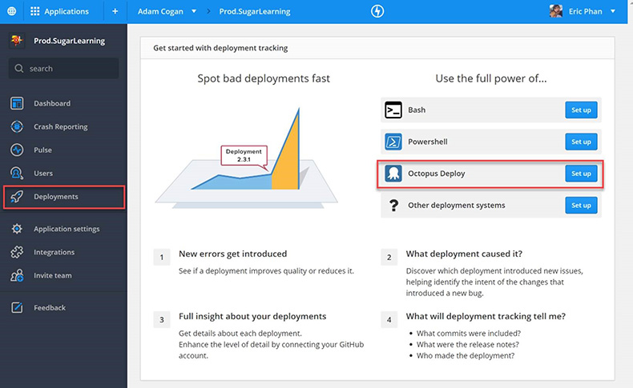

One of the best features of RayGun is the ability to track crash reports against deployments. This feature allows you to tell if a particular deployment has introduced a lot of new bugs or caused a regression of exceptions. ​ 

To set it up:​ 

 <excerpt class='endintro'></excerpt> 
<ol><li>Under Deployments </li><li>Select Octopus Deploy (Set up)  
      <dl class="image"><dt>  </dt></dl>
Raygun will product you with a <a href="https://raygun.com/docs/deployments/octopus-deploy" target="_blank">PowerShell script </a> to add into your octopus deployment steps that will call the RayGun API and log a new deployment
</li><li>Trigger a new deployment</li><li>Then you’ll see the deployment in RayGun 
   <dl class="image"><dt></dt></dl>
Drilling into a deployment you’ll see:
<ul><li>New errors</li><li>Regressions</li><li>Recurring errors</li></ul><dl class="goodImage"><dt>  </dt><dd>Figure: Good Example – Now you can measure the quality of your deployments  </dd> </dl></li></ol>

