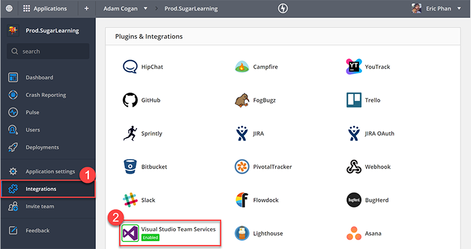
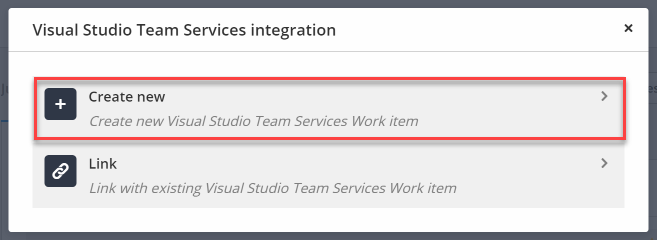
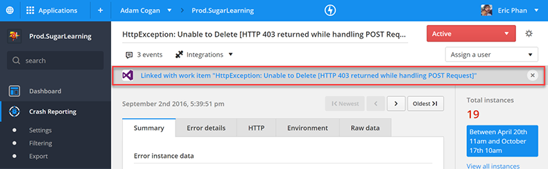

TFS/VisualStudio.com is the source of truth for product development, so how do you get issues in RayGun into TFS? Thankfully there’s a built in integration that lets you do that.  
 <excerpt class='endintro'></excerpt> 
<ol><li>Under Integrations </li><li>Select Visual Studio Team Services</li><li>Connect to your TFS or VisualStudio.com instance</li></ol><dl class="image"><dt>
      
   </dt><dd>Figure: Link RayGun with TFS/VisualStudio.com</dd></dl>
Now under the crash report, you have to option to create a PBI and link it to the crash report.
<dl class="image"><dt>
      
   </dt><dd>Figure: Create a new PBI or link to an existing PBI</dd></dl>
Now you can see which RayGun create reports have already been added to the backlog.
<dl class="image"><dt>
      
   </dt><dd>Figure: Link RayGun with TFS/VisualStudio.com </dd></dl>

RayGun is a useful tool to use for your DevOps. Check out our rule “<a href=/do-you-know-how-devops-fits-in-with-scrum>Do you know how DevOps fits in with Scrum?​​</a>”​​ 

