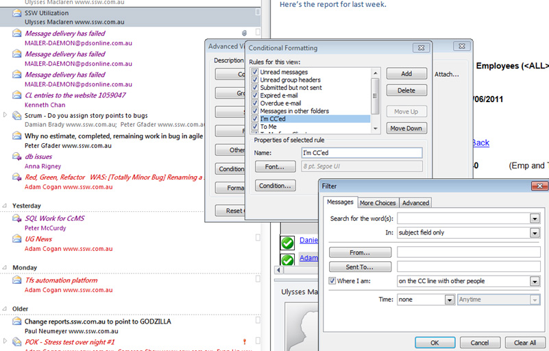

Cut down the noise in your inbox by visually filtering emails not sent directly to you.

See the example below - on all emails where you are 'on the CC line' you can mark them in grey.

<!--endintro-->

::: good\
\
:::