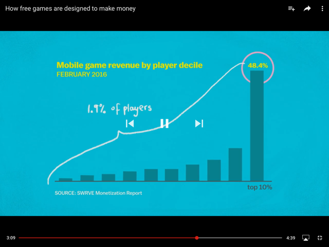

​
Do you know free games are designed to make money? See the good and bad examples:

 <excerpt class='endintro'></excerpt> 

 
     

<dd class="ssw15-rteElement-FigureBad"> Bad example: paid apps </dd><dd class="ssw15-rteElement-FigureGood">Good example: free apps with in-app purchases</dd>
 
     

<dd class="ssw15-rteElement-FigureBad">Bad example: paid with currency</dd><dd class="ssw15-rteElement-FigureGood">Good example: paid with abstract currency </dd>
 
     

<dd class="ssw15-rteElement-FigureBad">Bad example: treat all customers the same</dd><dd class="ssw15-rteElement-FigureGood">Good example: detect when a customer might leave and offer them incentives</dd>
 
     

<dd class="ssw15-rteElement-FigureBad">Bad example: same prices for everyone</dd><dd class="ssw15-rteElement-FigureGood">Good example: capture data eg. What device and do data mining to set different prices ​ </dd>
 
     

<dl class="image"><dt>
 
   <iframe width="640" height="360" src="https://www.youtube.com/embed/fKK9nVLvhGM" frameborder="0"></iframe> 
</dt></dl>​
<dl class="image"><dt>
       
   </dt><dd>Figure: some apps charge more based on the device you are using </dd></dl><dl class="image">​ 
   <dt> 
       
   </dt><dd>Figure: know app developers make most of their in-app purchases from the whales 🐳</dd></dl>

