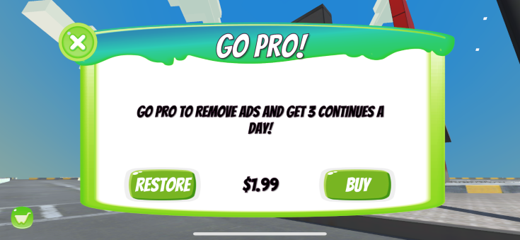

You don't have to charge users for your software. In fact, even free apps and games are designed to make money. Do you know the best way to monetize your apps?

<!--endintro-->

Apps make money in all sorts of ways, even the 'free' ones. You need to choose the right monetization model for your apps depending on it's functionality and audience.

## Free vs Paid Apps
Some apps require a form of payment, meaning you must pay for the app before you can use it. Others are 'free', meaning you can use the software, and all it's features, without paying for it. These apps make money in other ways. The middle ground is called 'freemium', which is where you get the basic app or game for free, but need to pay to access advanced features.

## Payment Models
Whether your app is paid up front or freemium, if you need to collect money at some point from your users, there are a few ways to do it:

### One-time fee
This is the traditional approach, where you set a price for your app or game, and users must buy it before they can use it. This might be the right approach for you if:
* Your product is a AAA gaming title
* Your product is a useful, but not essential, productivity tool
* Your product is *NOT* a SaaS product (one-off payments are difficult to reconcile against ongoing cloud and hosting costs)

::: good

**Good Example:** [The Legend of Engadine](https://engadine.net) on iOS and Android is free to play, but a one-time purchase unlocks premium features.
:::
    
One-time fees work with either paid apps or freemium apps; users can either buy the app up-front or use the app for free, and pay to unlock premium features.

### Subscription fee
Subscriptions have become much more popular, even for traditional desktop software. Rather than pay a one-time fee, users pay a recurring monthly or annual fee to use the software. This might be the right approach for you if:
* Your product is a SaaS product
* Your product is likely to get recurring regular use *without* you needing to continually drive engagement (e.g., an essential, or at least high value, productivity tool)
* Your product has other ongoing maintenance costs (e.g. content development)

::: good

**Good Example:** [Microsoft 365](https://www.microsoft.com/microsoft-365) (formerlly Office 365) is a suite of productivity tools that run on mobile, desktop and web. For a low recurring cost, users get access to these apps and the connected services that tie them together in the cloud.
:::

### Micro-transactions
Micro-transactions is the practice of continually charging comparitively small amounts of money over a long period of time. Generally, micro-transactions are considered unethical because they are closely aligned with nefarious practices like [dark patterns](https://www.youtube.com/watch?v=lJUW0iZzAaQ), 'pay-to-win' or exploiting gambling addition.
    
For these reasons, micro-transactions are [increasingly](https://www.vg247.com/australian-government-rules-games-microtransactions-must-address-packaging) [subject](https://www.gamespot.com/articles/you-might-have-to-prove-your-age-to-buy-a-loot-box/1100-6474443/) to scrutiny from [governments](https://www.aph.gov.au/Parliamentary_Business/Committees/House/Social_Policy_and_Legal_Affairs/Onlineageverification/Report) and [regulators](https://www.gamesindustry.biz/australian-investigation-finds-loot-boxes-are-pscyholgocially-akin-to-gambling). This might be the right approach for you if:
* You don't mind profiting from the suffering of others
* You are morally bankrupt
* You would consider a sacrifice of your first-born child to the Devil in exchange for wealth to be a worthwhile transaction

::: bad
`youtube: https://www.youtube.com/embed/fKK9nVLvhGM`
**Example:** Pokemon Go, one of the most succesful mobile apps of all time, combines the freemium model with micro-transactions to exploit a vulnerable subset of users. It's incredibly effective, but unethical.
:::

## Monetizing free apps

### Ad revenue

### Loss leader

### Data mining

### Resource utilization