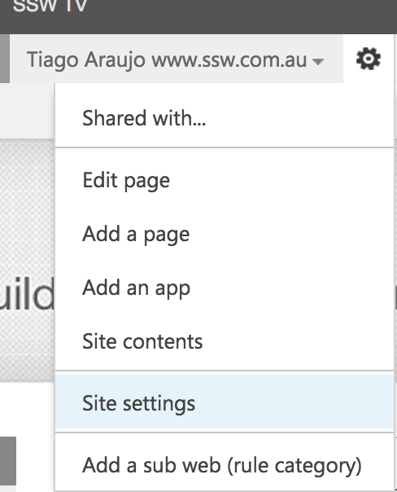
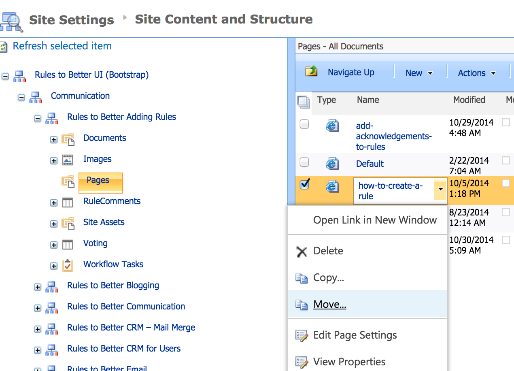
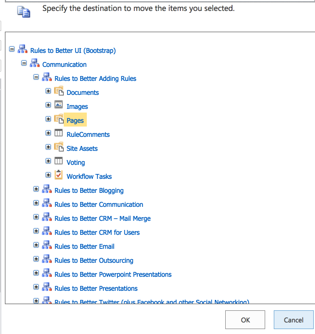

Moving a rule page from a folder to another is not needed anymore. All rule pages are staying in the same library (folder called "Pages") since we moved the rule pages from 100+ subwebs into the root one.

If you want a rule page to be shown on a different rule summary page, simply change the "Rule Category" field value to the relevant one (see step #7 on [Do you know how to create a rule?](/how-to-create-a-rule))

--

Sometimes you might need to move a rule from a category to another. You can do this by following these steps:

<!--endintro-->

1. Click on "Site Settings": 
      
  

2. Under "Site Administration", click on "Content and structure": 
      
  

3. Navigate on the categories and pages to find the rule you want to move: 
      
  

4. Select the new location where the rule should be: 
      

