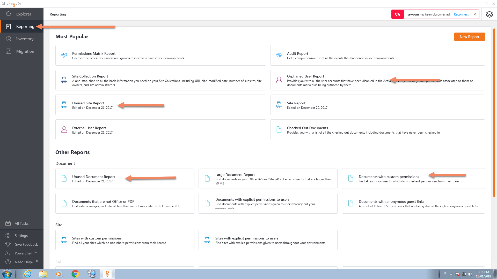
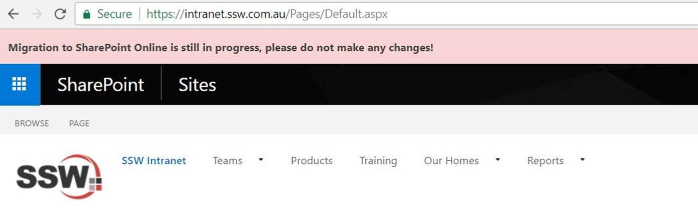

​
Before migrating your content over SharePoint Online, you want to get rid of unused or old content. Migration is the perfect time to audit your content and delete what you can. You may also use the migration to identify (and get rid of) Orphan Users, and Documents with Custom permissions (look for SharePoint best practices on permissions). 

 <excerpt class='endintro'></excerpt> 

Use the Sharegate migration tool to generate reports on your site collections and sites, so you can easily identify problems. Reporting tool comes with a lot of out of the box reports, and you can even create custom ones. 
<dl class="image"><dt>​​​ </dt><dd>Figure: Sharegate reporting menu have 4 main reports</dd></dl>
Once identified, check with Site Owners to ensure the content can be deleted. Alternatively, if you don't want to delete content, you can ZZed it.​​ 

Ideally, before migration starts, you should put your source sites to read-only mode using "site collection lock". But if you cannot put your source sites into read-only mode due to some reasons (e.g. migration tool needs to write auditing logs), then at least put a notification bar on the top of your site to prevent users editing it during the migration. 
<dl class="ssw15-rteElement-ImageArea"></dl>
 

Sharegate supports 'Pre-check' before kicking off the real migration, it can tell the potential errors. For example, you might have orphen users do not exist in Office 365, which you might have to temporarily enable to ensure the "Created By" and "Modified By" user info is correctly migrated for ASPX pages (ASPX pages do not support insant mode). 

