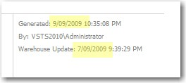
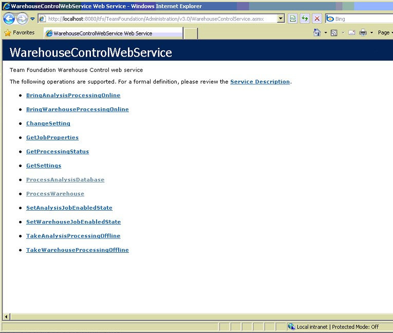
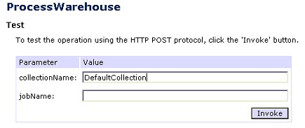
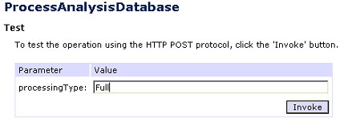

**Note:** These are instructions for TFS 2010 Beta 2

If you enter data and then look at reports you will see stale data!!!

The UI does not provide an easy option. However you have 2 \*hard\* ways of updating the TFS Data Warehouse.

**Option 1** - Open SQL Management Studio and then force re-processing\
**Option 2** - Open the TFS Web Services in IE and then force processing (Recommended - see below)

#### More info on Option 2

Follow these instructions to reprocess the data warehouse using the web services (this took us a long time to work out):

1. Open IIS Manager
2. Go to "Team Foundation Server"
3. Open the feature "Directory browsing"
4. "Enable"
5. Back to "Team Foundation Server"
6. "Browse website"
7. Browse to <http://localhost:8080/tfs/TeamFoundation/Administration/v3.0/WarehouseControlService.asmx>

   

8. Invoke "ProcessWarehouse" with the parameter "DefaultCollection" (or whatever your collection is called)

   

9. Invoke "ProcessAnalysisDatabase" with parameter "Full"

   

10. Now once the the reprocess is completed, the reports are up to date

More info see the blog entry from Grant Holliday:[http://ozgrant.com/2006/05/15/forcing-data-warehouse-update-for-tfs/](https://www.ssw.com.au/SSW/Redirect/ForceDataWarehouseforUpdateTFS.htm)

Note: [We have a suggestion to the TFS team for this.](https://www.ssw.com.au/ssw/Standards/BetterSoftwareSuggestions/TeamFoundationServer.aspx%22%20%5Cl%20%22RefreshTFSCube)

[See the suggestion for a VS extension to Refresh Report Data](https://www.ssw.com.au/ssw/Standards/BetterSoftwareSuggestions/TeamFoundationServer.aspx%22%20%5Cl%20%22RefreshData)