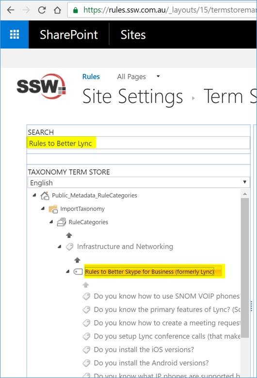
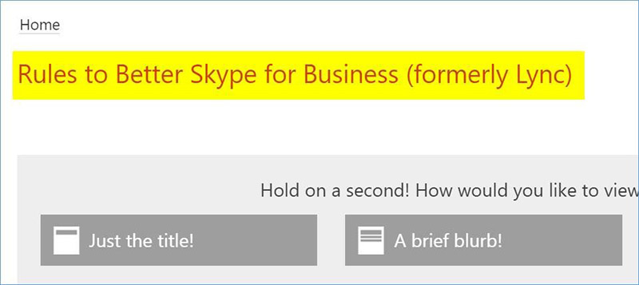
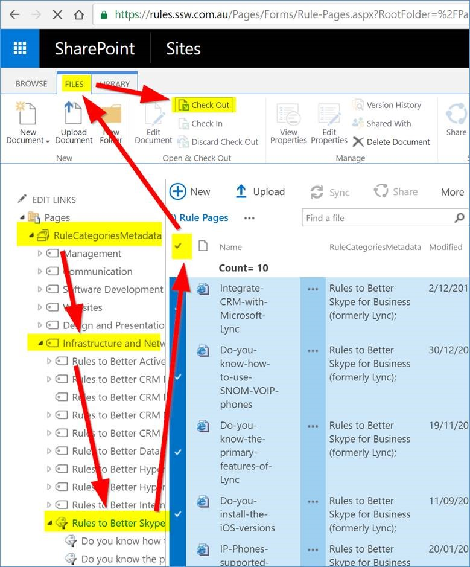
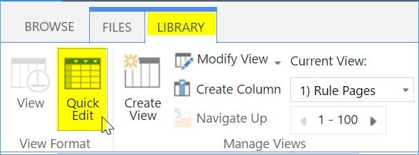
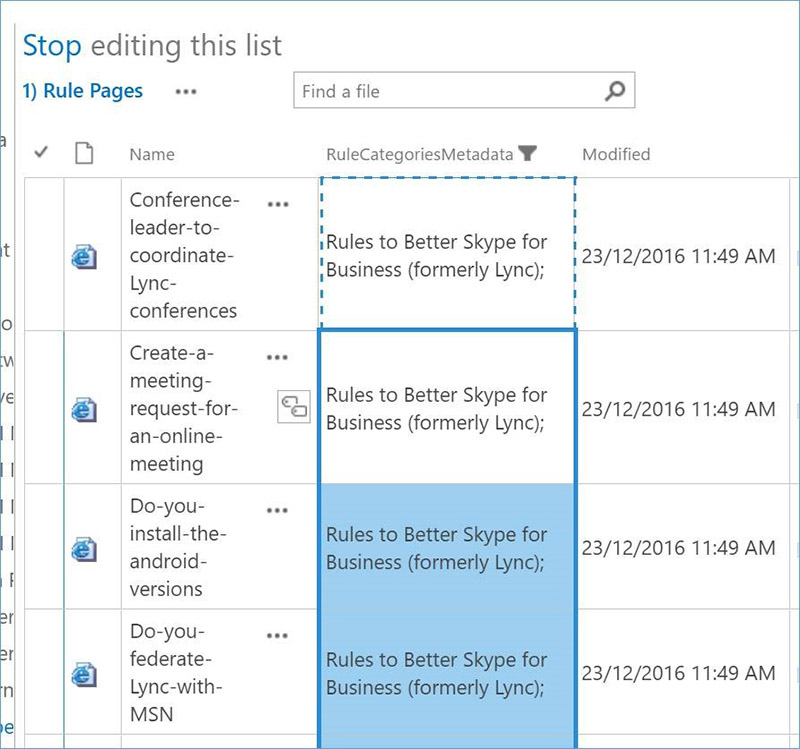

To update a rule category name, please follow these steps:​ 

 <excerpt class='endintro'></excerpt> 
<ol><li>
      <strong>Rename “category name" in metadata:</strong> Go to <a href="/_layouts/15/termstoremanager.aspx?tsid=eacc332d045a40e1bcc10498d65b767f">https://rules.ssw.com.au/_layouts/15/termstoremanager.aspx?tsid=eacc332d045a40e1bcc10498d65b767f</a> E.g. Search “Rules to Better Lync" to find it, double click the “term item title" to rename it to “Rules to Better Skype for Business (formerly Lync)"  
      <dl class="image"><dt></dt></dl></li><li>
      <strong>Rename “rule summary page" title:</strong> Go to the “Rule Summary page", edit its title with the new name “Rules to Better Skype for Business (formerly Lync)": <dl class="image"><dt></dt></dl></li><li>
      <strong> </strong><strong style="text-decoration:line-through;">Update “rule category field value" for sub-rules:</strong> 
      <ol style="list-style:lower-alpha;"><li style="text-decoration:line-through;">Go to <a href="/Pages/Forms/Rule-Pages.aspx">https://rules.ssw.com.au/Pages/Forms/Rule-Pages.aspx</a>, use the left navigation to filter and find all the rules under this category. Use the 1st “tick icon" to select all of them, then click “<strong>Files</strong>" | “<strong>Check Out</strong>" to check them out: <dl class="image" style="text-decoration:line-through;"><dt></dt></dl></li><li style="text-decoration:line-through;">Use “Library" | “Quick Edit" to switch to “quick edit" mode: <dl class="image" style="text-decoration:line-through;"><dt></dt></dl></li><li style="text-decoration:line-through;">Update the 1st row with new “category name", then you can use “copy & paste" to update all the rest in one goal. <dl class="image" style="text-decoration:line-through;"><dt></dt></dl></li><li>Check-in and publish all the rules when you finish your modification.</li></ol></li><li>
      <strong>[Optional] Rename “page URL"</strong> If you want to rename the page URL too, please refer <a href=/rename-a-rule>https://rules.ssw.com.au/rename-a-rule </a>   </li></ol> ​ 

