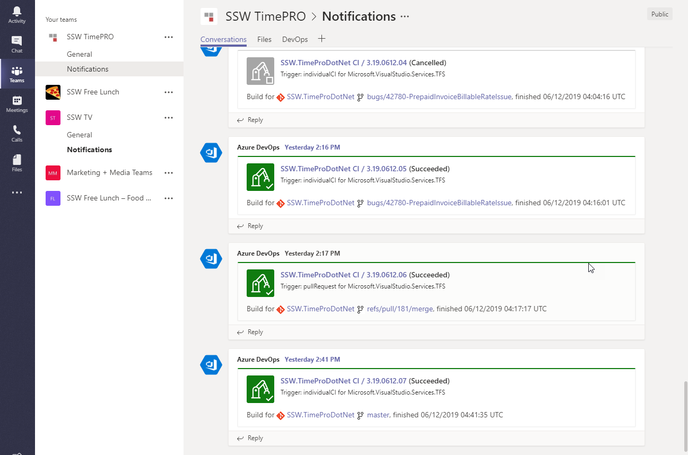

Imagine you’ve been on vacation for several weeks (lucky you!) and on returning you want to see what’s been happening in your project in your absence.  If your project used a “team” within Microsoft Teams, you’d easily be able to review the team’s conversations and progress. You’d be able to see what issues have arisen and where the team has been spending their time. 

<!--endintro-->

A "team" is a great way for teams to communicate and have a persistent forum to share information and discuss project related topics. The extensibility of a team also allows [the addition of tabs that integrate with 3rd party applications](/add-the-right-tabs-when-creating-a-new-teams-conversation) to bring timely and relevant information into the team site. This allows team members to see at a glance what has been happening on the project.

You can also add Bots to communicate on your channel, or even better, Connectors! You can add Connectors that, for example, notify you of any new pull requests in Azure DevOps or GitHub. Microsoft used to have several social media Connectors, but these have been retired. It is possible, but more difficult, to add social media notifications with Power Automate, or with a third-party service such as IFTTT.

::: greybox
**To:** All Developers
**Subject:** What’s been happening on SSWTimePro in the last couple of weeks

Hi Devs,
I’ve been away for a couple of weeks. Can you tell me what’s the latest?
:::

::: bad
Figure: Bad example - Broad email asking what’s been happening
:::

Teams can keep you abreast of all the events happening on your project.

::: good

:::
