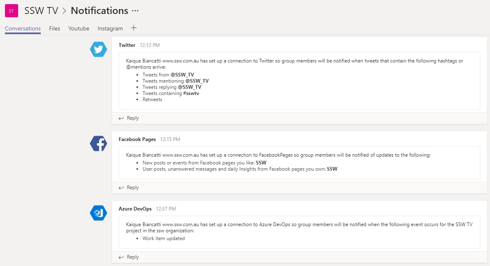

​​Imagine you’ve been on vacation for several weeks (lucky you!) and on returning you want to see what’s been happening in your project in your absence.  If your project used a “team” within Microsoft Teams, you’d easily be able to review the team’s conversations and progress. You’d be able to see what issues have arisen and where the team has been spending their time.   
 <excerpt class='endintro'></excerpt> 

A "team" is a great way for teams to communicate and have a persistent forum to share information and discuss project related topics. The extensibility of a team also allows <a href=/add-the-right-tabs-when-creating-a-new-teams-conversation>the addition of tabs that integrate with 3rd party applications</a> to bring timely and relevant information into the team site. This allows team members to see at a glance what has been happening on the project.

You can also add Bots to communicate on your channel, or, even better, Apps! You can add Apps that let you, for example, be notified of any # uses in Twitter that you want to monitor, or Facebook Pages that you want to follow. This is great for the Marketing team!  

 
   <b>To:</b> All Developers <b>Subject: </b>What’s been happening on SSWTimePro in the last couple of weeks  Hi Devs, I’ve been away for a couple of weeks. Can you tell me what’s the latest? 
<dd class="ssw15-rteElement-FigureBad">Figure: Bad example - Broad email asking what’s been happening  </dd>
 

Teams can keep you abreast of all the events happening on your project. 
<dl class="goodImage"><dt> ​​​ ​ </dt><dd>Good example: See that a record of team conversations, builds, and deployments </dd></dl> 

If you are part of the Marketing team, be aware that every time a new post is out and there's a video in it, it should include the hashtag #sswtv across all our social media:  - A new post on Twitter #sswtv - A new post on Facebook #sswtv - A new post on LinkedIn #sswtv - A new post on Instagram #sswtv  This is necessary because of the notifications tab our Media team have on their Teams group as per the photo below. This way every time a new video is out they'll know!   <strong>Figure: all social media posts related to videos will be tracked on SSW TV Teams group </strong> 

