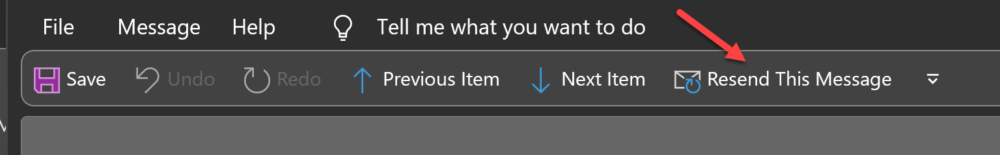

If you receive feedback about an email you've sent, it will likely be in one of 3 forms:

<!--endintro-->

1. Hints for what could be better for next time, in which case all that's required is you take the feedback on board
2. Changes or clarifications to the content, that can act as the latest version of the thread, without needing a re-send
3. Changes or clarifications that are so substantial that they require you to resend your email in the form of a v2

   1. This ensures that you understand the feedback and incorporate it immediately
   2. It also cleans up the email thread history to only have relevant content

The other reason for a v2 would be if you realise you've made a mistake and want to send an updated version of an email.

To send a v2:

1. Open your V1 email in Sent item
2. Click Actions | Resend this message
3. Put V2 on the 1st line of the email body

   **Note:** Do not put v2 in the subject because we want to keep the threading.
4. Keep the email history leading up to your v1 email, replace your v1 with your v2 email, as if the v1 never happened
5. If all the feedback is incorporated into the v2, there is no need for an additional done email. However if there are additional tasks in the feedback, it may be necessary to reply done to those as well as sending a v2 (i.e. 2 emails)

::::greybox
**Tip!** If you are doing a lot of these you can add the Resend this message to the quick access toolbar in Outlook.\

::::